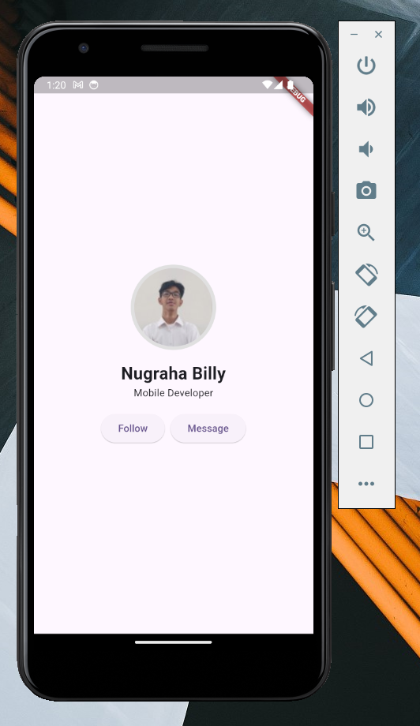
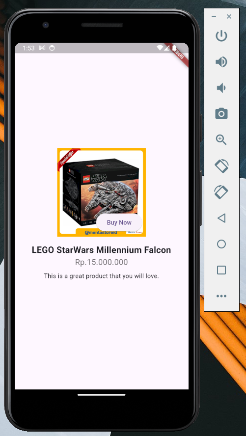
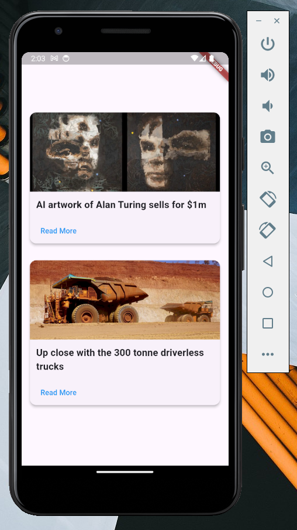
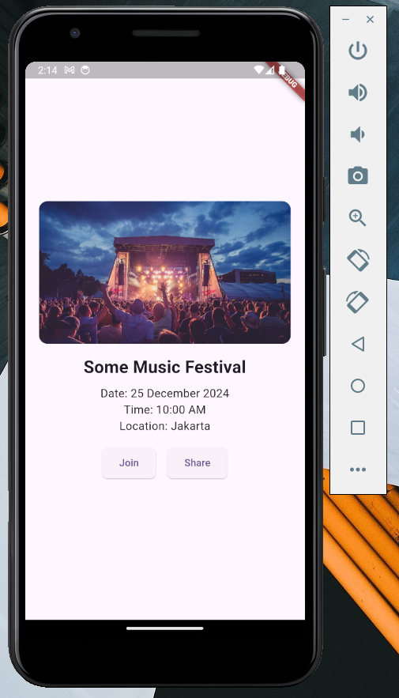

# Dart & Flutter: Take Your First Steps in Mobile App Development

::: tip Setup Preparation

Before starting, make sure you’ve completed these steps:

1. **Install Flutter & Dart**: Ensure Flutter SDK is installed and Dart is properly configured.
2. **Set up VS Code**: Install the Flutter and Dart plugins in Visual Studio Code.
3. **Create a New Flutter Project**: Open VS Code, press `Ctrl+Shift+P`, select `Flutter: New Project`, and name it.
4. **Launch the Emulator**: Open Android Studio or use `flutter emulators --launch <emulator_name>` to start the emulator.

:::

### Case Study 1: Simple Profile Page

**Description:**  
Create a profile page that displays a profile picture, name, and brief description. This page should also include two action buttons underneath the profile information.

**Implementation:**

- **`Column`**: Used to organize the profile elements vertically.
- **`Stack`**: Utilized to position the profile picture with a circular background.
- **`Row`**: Used to arrange two action buttons horizontally at the bottom.

::: details Outcome Example 📱

<br>


:::

::: details Code Fragments (Easy) 🧩

```dart
import 'package:flutter/material.dart';

class CaseStudy1 extends StatelessWidget {
  const CaseStudy1({super.key});

  @override
  Widget build(BuildContext context) {
    return Column(
      mainAxisAlignment: MainAxisAlignment.center,
      crossAxisAlignment: CrossAxisAlignment.center,
      children: [
        // TODO: Add a Stack here to build the profile image with a border effect
        // TODO: Add Text widgets for the name and role
        // TODO: Add a Row for action buttons (Follow and Message)
      ],
    );
  }
}
```

<br>

```dart
Stack(
  alignment: Alignment.center,
  children: [
    CircleAvatar(
      radius: 60,
      backgroundColor: Colors.grey[300],
    ),
    // TODO: Add a CircleAvatar here to build the profile image
  ],
),
```

<br>

```dart
const CircleAvatar(
    radius: 55,
    backgroundImage: NetworkImage('your-profile-picture-url'),
),
```

<br>

```dart
const SizedBox(height: 16),
const Text(
  'Your Name',
  style: TextStyle(fontSize: 24, fontWeight: FontWeight.bold),
),
const Text('Your Position'),
```

<br>

```dart
const SizedBox(height: 16),
Row(
  mainAxisAlignment: MainAxisAlignment.center,
  children: [
    // TODO: Add an ElevatedButton here to build the "Follow" button
    const SizedBox(width: 8),
    // TODO: Add an ElevatedButton here to build the "Message" button
  ],
),
```

<br>

```dart
ElevatedButton(onPressed: () {}, child: const Text('Follow')),
```

<br>

```dart
ElevatedButton(onPressed: () {}, child: const Text('Message')),
```

:::

---

### Case Study 2: E-commerce Product Page

**Description:**
Develop a simple product page for an e-commerce app. Each product should have a large image at the top, a product name, price, and description, with a “Buy Now” button overlayed on top of the product image.

**Implementation:**

- **`Column`**: Used to structure the product image, name, price, and description vertically.
- **`Stack`**: Used to overlay the “Buy Now” button on top of the product image for quick purchase access.

::: details Outcome Example 📱

<br>


:::

::: details Code Fragments (Medium) 🧩

```dart
import 'package:flutter/material.dart';

class CaseStudy2 extends StatelessWidget {
  const CaseStudy2({super.key});

  @override
  Widget build(BuildContext context) {
    return Center(
      child: Column(
        // TODO: The alignment here doesn't match the expected outcome. Can you fix it?
        mainAxisAlignment: MainAxisAlignment.start,
        crossAxisAlignment: CrossAxisAlignment.start,
        children: [
          // TODO: Add a Stack for the product image and "Buy Now" button here
          // TODO: Add Text widgets for product name, price, and description below
        ],
      ),
    );
  }
}
```

<br>

```dart
Stack(
  alignment: Alignment.bottomRight,
  children: [
    Image.network(
      'your-product-url',
      height: 150,         // TODO: Incorrect height. Can you find the right value?
      fit: BoxFit.contain, // TODO: This doesn’t quite fit the design! Try adjusting it.
    ),
    // TODO: Position the "Buy Now" button at the bottom right corner of the image
  ],
),
```

<br>

```dart
Positioned(
  bottom: 20,              // TODO: Incorrect alignment. Can you adjust it?
  right: 20,               // TODO: This doesn’t quite align the button correctly.
  child: ElevatedButton(
    onPressed: () {},
    child: const Text('Buy Now'),
  ),
),
```

<br>

```dart
const SizedBox(height: 16),
const Text(
  'Your Product Name',
  textAlign: TextAlign.start, // TODO: This doesn’t center-align the text. Can you fix it?
  style: TextStyle(fontSize: 16, fontWeight: FontWeight.normal), // TODO: Style seems off. Can you find the correct values?
),
const Text(
  'Rp. Your Product Price',
  style: TextStyle(fontSize: 14, color: Colors.grey), // TODO: This doesn’t match the design!
),
```

<br>

```dart
const Padding(
  padding: EdgeInsets.all(16.0), // TODO: Padding is a bit too wide. Can you adjust it?
  child: Text(
    'This is a great product that you will love.',
    textAlign: TextAlign.center,
  ),
),
```

:::

---

### Case Study 3: News App Home Page

**Description:**
Create a home page for a news app that displays two main headlines at the top, followed by several additional news articles. Each article should feature a title, image, and a “Read More” button.

**Implementation:**

- **`Column`**: Used to organize news items vertically.
- **`Row`**: Used to align the two main headlines side by side horizontally.

::: details Outcome Example 📱

<br>


:::

::: details Code Fragments (Hard) 🧩

```dart
import 'package:flutter/material.dart';

class CaseStudy3 extends StatelessWidget {
  const CaseStudy3({super.key});

  @override
  Widget build(BuildContext context) {
    return const Center(
      child: Column(
        mainAxisAlignment: MainAxisAlignment.center,
        children: [
          // TODO: Add a NewsCard widget here
          // HINT: Use `NewsCard` with a title and imageUrl for each news article

          // TODO: Add a SizedBox with height: 16 for spacing

          // TODO: Add a second NewsCard widget here
        ],
      ),
    );
  }
}
```

<br>

```dart
class NewsCard extends StatelessWidget {
  final String title;
  final String imageUrl;

  const NewsCard({super.key, required this.title, required this.imageUrl});

  @override
  Widget build(BuildContext context) {
    return Card(
      // TODO: Add elevation for a slight shadow effect
      // HINT: Use `elevation: 4` for a balanced shadow

      // TODO: Set shape for rounded corners
      // HINT: Use `RoundedRectangleBorder` with `BorderRadius.circular(12)`

      // TODO: Add margin to give space around each NewsCard
      // HINT: Try `EdgeInsets.symmetric(horizontal: 16, vertical: 8)` for the margin

      child: Column(
        crossAxisAlignment: CrossAxisAlignment.start,
        children: [
          // TODO: Add an image and a Text widget for the news title
        ],
      ),
    );
  }
}
```

<br>

```dart
ClipRRect(
  // TODO: Add borderRadius to clip the top corners of the image
  // HINT: Use `BorderRadius.only(topLeft: Radius.circular(12), topRight: Radius.circular(12))`
  borderRadius: const BorderRadius.only(
    topLeft: Radius.circular(12),
    topRight: Radius.circular(12),
  ),
  child: Image.network(
    imageUrl,
    // TODO: Adjust image height, width, and fit to cover the card width and maintain aspect ratio
    // HINT: Use `height: 150`, `width: double.infinity`, and `fit: BoxFit.cover`
  ),
),
```

<br>

```dart
Padding(
  padding: const EdgeInsets.all(12.0),
  child: Text(
    title,
    // TODO: Style the text for better readability
    // HINT: Use `fontSize: 18` and `fontWeight: FontWeight.bold` to make the title stand out
  ),
),
```

<br>

```dart
Padding(
  padding: const EdgeInsets.symmetric(horizontal: 12),
  child: TextButton(
    onPressed: () {},
    // TODO: Style the button with a foreground color and padding
    // HINT: Use `foregroundColor: Colors.blue` and `padding: EdgeInsets.all(8.0)`
    child: const Text('Read More'),
  ),
),
```

:::

---

### Case Study 4: Event Details Page

**Description:**
Create an event detail page that features an event image at the top, followed by the event name, date, time, and location. Include “Join” and “Share” buttons at the bottom for user interaction.

**Implementation:**

- **`Column`**: Used to organize the event image, name, date, and other event details vertically.
- **`Row`**: Used to align the “Join” and “Share” buttons horizontally at the bottom.

::: details Outcome Example 📱

<br>


:::

::: details Code Fragments? 🧩
There are no code fragments, you can try it yourself 😂🫵🏻


:::
