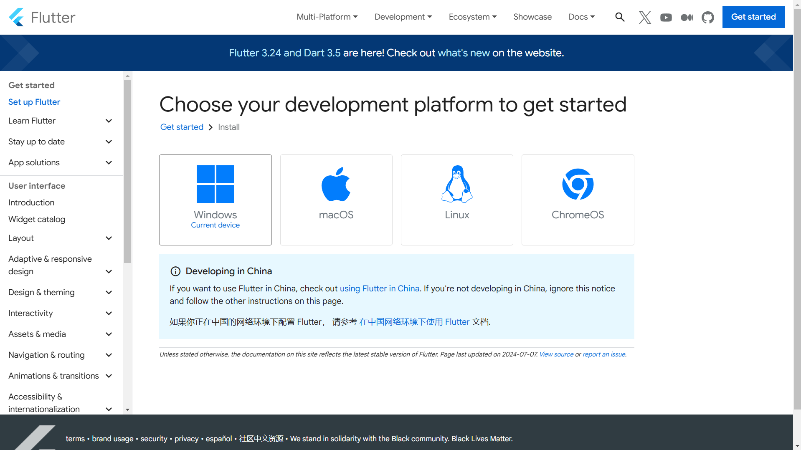
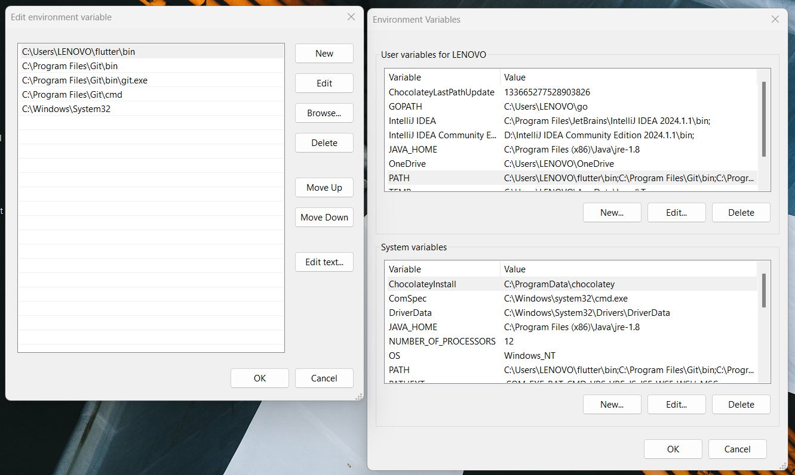
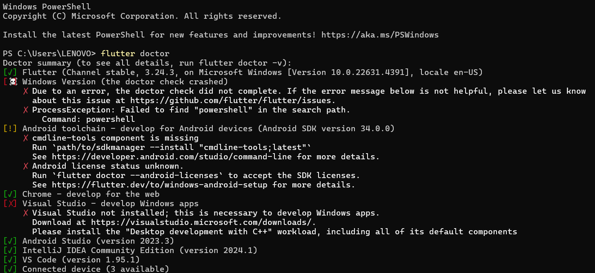
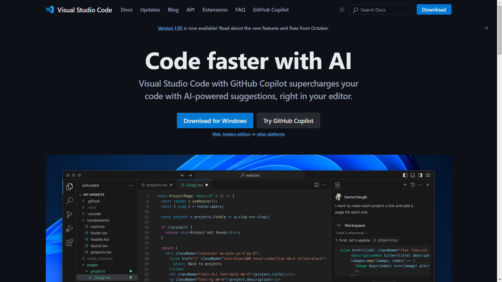
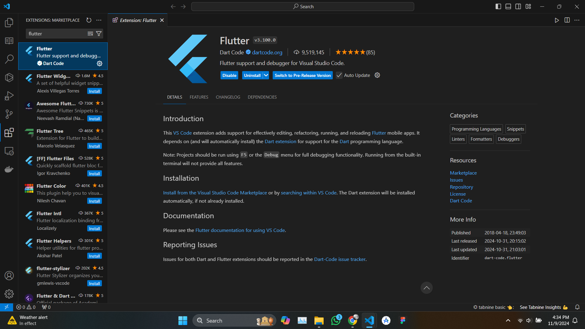
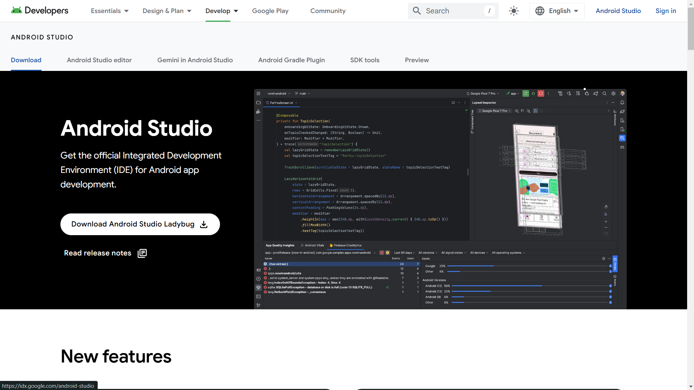
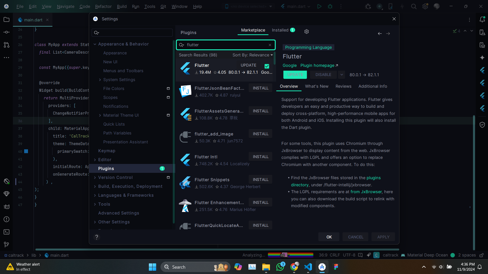
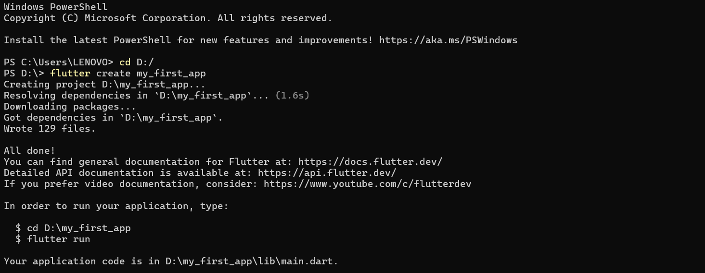
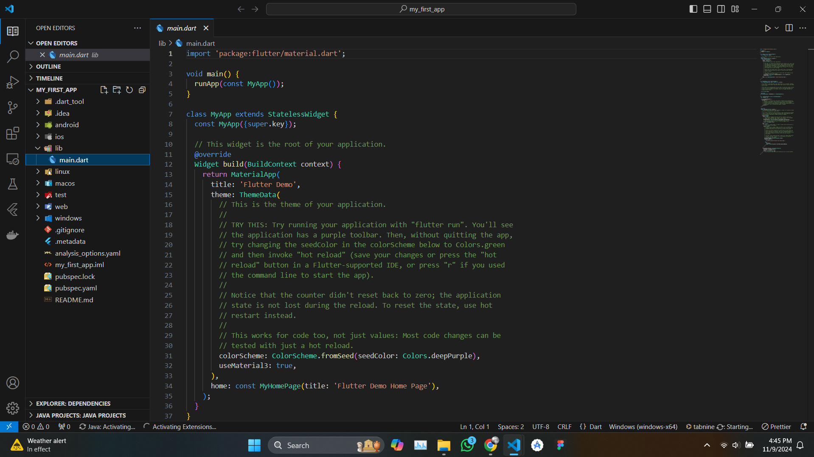

---
next:
  text: '2.2 Widgets Overview (Stateless vs Stateful Widgets)l'
  link: '/notes/android-development/section-2-2'
---

# 2.1 Setting up Flutter SDK and Development Environment

> Install Flutter, set up Android Studio/VS Code, and learn how to use the Flutter development tools.

Flutter is a popular open-source UI software development toolkit created by Google. It allows developers to build natively compiled applications for mobile, web, and desktop from a single codebase. In this article, we will guide you through the steps to set up the Flutter SDK and prepare your development environment.

::: details Overview of the Materials 📚

- **Flutter SDK Setup:** Download and install the Flutter SDK for your operating system (Windows, macOS, or Linux), extract it, and add it to your system’s PATH.
- **Run flutter doctor:** Check for any missing dependencies, such as Android Studio or Xcode, and follow instructions to install them.
- **Install IDE:** Install Visual Studio Code or Android Studio, and add the Flutter and Dart plugins.
- **Create First Project:** Use the terminal or IDE to create a new Flutter project and run it to ensure setup is complete.

:::

## Prerequisites

Before installing Flutter, ensure you have the following prerequisites:

- **Operating System**: Flutter supports Windows, macOS, and Linux.
- **Dart SDK**: Flutter comes bundled with the Dart SDK, so there's no need for a separate installation.
- **IDE**: You can use any text editor or IDE, but Flutter development is best supported with either **Visual Studio Code** or **Android Studio**.

## Step 1: Download the Flutter SDK

1. Visit the [official Flutter website](https://flutter.dev/docs/get-started/install).
2. Choose your operating system and follow the provided instructions to download the Flutter SDK.
3. Extract the downloaded zip file to a desired location on your machine.

   For example, on macOS, you might extract it to your home directory.

## Step 2: Update Your Path

To run Flutter commands in any terminal session, you need to add the Flutter SDK to your system’s PATH.

### macOS and Linux

Add the appropriate line to your shell configuration file (e.g., `.bashrc`, `.zshrc`, or `.bash_profile`).

### Windows

1. Right-click on `This PC` or `Computer` and select `Properties`.
2. Click on `Advanced system settings`.
3. Click on `Environment Variables`.
4. Under System Variables, find the `Path` variable and click `Edit`.
5. Add the full path to the `flutter/bin` directory.

## Step 3: Run Flutter Doctor

After adding Flutter to your PATH, open a terminal and run the command to check for any dependencies you may need to install. The `flutter doctor` command checks your environment and displays a report of the status of your Flutter installation. It may prompt you to install additional tools, such as:

- **Android Studio** (for Android development)
- **Xcode** (for iOS development on macOS)

Follow the instructions to install any missing dependencies.

## Step 4: Install an IDE

### Visual Studio Code

1. Download and install [Visual Studio Code](https://code.visualstudio.com/).

2. Open Visual Studio Code and install the Flutter and Dart plugins:
   - Go to Extensions.
   - Search for `Flutter` and install the plugin.
   - The Dart plugin will be installed automatically with Flutter.

### Android Studio

1. Download and install [Android Studio](https://developer.android.com/studio).
2. During installation, make sure to select the option to install the Android SDK.

3. After installation, open Android Studio and follow these steps to install the Flutter plugin:
   - Go to `File` > `Settings` (or `Android Studio` > `Preferences` on macOS).
   - Select `Plugins` from the sidebar.
   - Search for `Flutter` and install it. The Dart plugin will be installed automatically as well.

## Step 5: Create Your First Flutter Project

1. Open your terminal or IDE.
2. Navigate to the directory where you want to create your project.
3. Run the command to create a new Flutter project, replacing `my_first_app` with your desired project name.
4. Navigate into the project directory.
5. Run the project using the command.

## References

- [Flutter Documentation](https://flutter.dev/docs)
- [Flutter Installation Guide](https://flutter.dev/docs/get-started/install)
