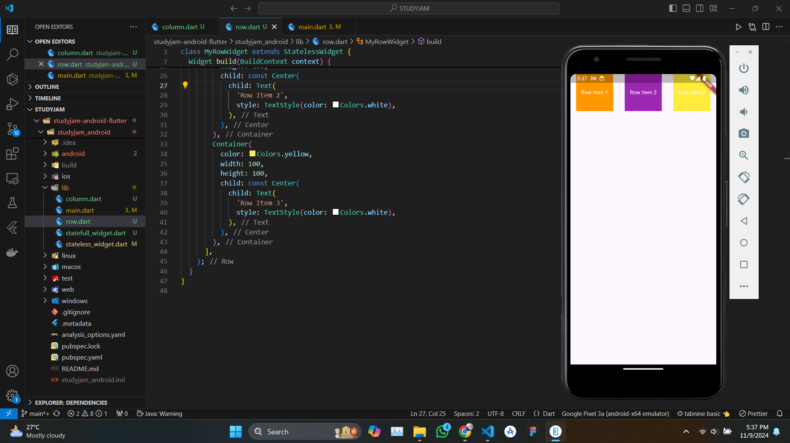

---
next:
  text: '2.4 Hot Reload and Hot Restart'
  link: '/notes/android-development/section-2-4'
---

# 2.3 Layout Basics (Column, Row, Stack)

> Understand how to arrange UI components using common layout widgets like Column, Row, and Stack.

In Flutter, layout is a critical component for crafting engaging user interfaces. Flutter offers a variety of layout widgets that allow developers to position and organize widgets on the screen effectively. This article focuses on three fundamental layout widgets: **Column**, **Row**, and **Stack**. Each widget serves a unique purpose and can be combined to create complex UI designs.

::: details Overview of the Materials 📚

- **Column:** Organizes children vertically. Best for forms, vertical lists, or stacked components.
- **Row:** Organizes children horizontally. Ideal for horizontal layouts, like navigation bars or toolbars.
- **Stack:** Overlays children on top of each other. Used for complex visual designs where elements overlap.

:::

## Column


The **Column** widget arranges its children in a vertical direction. It takes a list of widgets and positions them one below the other, allowing for flexible vertical layouts.

```dart
import 'package:flutter/material.dart';

class MyColumnWidget extends StatelessWidget {
  const MyColumnWidget({super.key});

  @override
  Widget build(BuildContext context) {
    return Column(
      children: [
        Container(
          color: Colors.blue,
          height: 100,
          child: const Center(
            child: Text(
              'Column Item 1',
              style: TextStyle(color: Colors.white),
            ),
          ),
        ),
        Container(
          color: Colors.green,
          height: 100,
          child: const Center(
            child: Text(
              'Column Item 2',
              style: TextStyle(color: Colors.white),
            ),
          ),
        ),
        Container(
          color: Colors.red,
          height: 100,
          child: const Center(
            child: Text(
              'Column Item 3',
              style: TextStyle(color: Colors.white),
            ),
          ),
        ),
      ],
    );
  }
}
```

### Key Properties

- **Main Axis Alignment**: The `mainAxisAlignment` property controls the vertical alignment of the children within the Column. It accepts values like:

  - `MainAxisAlignment.start`: Aligns children at the top.
  - `MainAxisAlignment.center`: Centers children vertically.
  - `MainAxisAlignment.end`: Aligns children at the bottom.
  - `MainAxisAlignment.spaceBetween`: Places free space between the children.
  - `MainAxisAlignment.spaceAround`: Distributes free space evenly around the children.

- **Cross Axis Alignment**: The `crossAxisAlignment` property manages the horizontal alignment of children. Possible values include:
  - `CrossAxisAlignment.start`: Aligns children to the start (left).
  - `CrossAxisAlignment.center`: Centers children horizontally.
  - `CrossAxisAlignment.end`: Aligns children to the end (right).

### Use Cases

The Column widget is ideal for creating vertical lists, forms, or any UI element that requires stacking components vertically. For example, you might use a Column to lay out a login form with fields for username and password.

## Row



The **Row** widget, on the other hand, arranges its children horizontally. It displays a list of widgets side by side, enabling flexible horizontal layouts.

```dart
import 'package:flutter/material.dart';

class MyRowWidget extends StatelessWidget {
  const MyRowWidget({super.key});

  @override
  Widget build(BuildContext context) {
    return Row(
      mainAxisAlignment: MainAxisAlignment.spaceAround,
      children: [
        Container(
          color: Colors.orange,
          width: 100,
          height: 100,
          child: const Center(
            child: Text(
              'Row Item 1',
              style: TextStyle(color: Colors.white),
            ),
          ),
        ),
        Container(
          color: Colors.purple,
          width: 100,
          height: 100,
          child: const Center(
            child: Text(
              'Row Item 2',
              style: TextStyle(color: Colors.white),
            ),
          ),
        ),
        Container(
          color: Colors.yellow,
          width: 100,
          height: 100,
          child: const Center(
            child: Text(
              'Row Item 3',
              style: TextStyle(color: Colors.white),
            ),
          ),
        ),
      ],
    );
  }
}
```

### Key Properties

- **Main Axis Alignment**: Similar to the Column, the `mainAxisAlignment` property in Row controls the horizontal alignment. It can be set to values like:

  - `MainAxisAlignment.start`: Aligns children to the left.
  - `MainAxisAlignment.center`: Centers children horizontally.
  - `MainAxisAlignment.end`: Aligns children to the right.
  - `MainAxisAlignment.spaceBetween`: Creates space between children.
  - `MainAxisAlignment.spaceAround`: Distributes space evenly around children.

- **Cross Axis Alignment**: The `crossAxisAlignment` property determines the vertical alignment of children within the Row:
  - `CrossAxisAlignment.start`: Aligns children to the top.
  - `CrossAxisAlignment.center`: Centers children vertically.
  - `CrossAxisAlignment.end`: Aligns children to the bottom.

### Use Cases

The Row widget is perfect for creating horizontal layouts, such as navigation bars, toolbars, or buttons arranged in a line. For instance, you might use a Row to place icons or buttons next to each other in a toolbar.

## Stack


The **Stack** widget enables you to overlay widgets on top of one another. It positions its children relative to the edges of the stack, allowing for complex visual designs where widgets can overlap.

```dart
import 'package:flutter/material.dart';

class MyStackWidget extends StatelessWidget {
  const MyStackWidget({super.key});

  @override
  Widget build(BuildContext context) {
    return Stack(
      alignment: Alignment.center,
      children: [
        Container(
          width: 150,
          height: 150,
          color: Colors.grey[300],
          child: const Center(
            child: Text(
              'Background',
              style: TextStyle(color: Colors.black),
            ),
          ),
        ),
        Container(
          width: 100,
          height: 100,
          color: Colors.blue,
          child: const Center(
            child: Text(
              'Overlay',
              style: TextStyle(color: Colors.white),
            ),
          ),
        ),
      ],
    );
  }
}
```

### Key Properties

- **Alignment**: The `alignment` property allows you to define how the children are aligned within the Stack. For instance, you can align them to the center, top, bottom, left, or right.

- **Children List**: The order of the children in the Stack matters; the first child is drawn at the bottom, while the last child is drawn on top. You can also use the `Positioned` widget to specify the exact position of a child within the Stack.

### Use Cases

The Stack widget is useful for creating layered designs, such as image galleries, cards with overlays, or any UI where elements need to overlap. For example, you might use a Stack to display a profile picture with a badge overlay.

## References

- [Flutter Layout Documentation](https://flutter.dev/docs/development/ui/layout)
- [Flutter Widget Catalog](https://flutter.dev/docs/development/ui/widgets)
