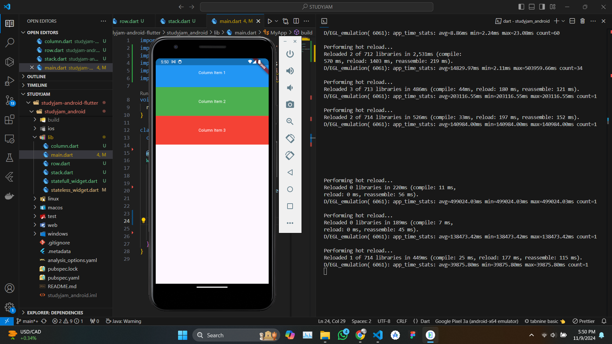

---
next:
  text: '3.1 Understanding the Widget Tree'
  link: '/notes/android-development/section-3-1'
---

# 2.4 Hot Reload and Hot Restart

> Discover how Flutter’s Hot Reload and Hot Restart features speed up development by instantly reflecting code changes.

Flutter is renowned for its developer-friendly features, among which **Hot Reload** and **Hot Restart** are pivotal for streamlining the development process. These features significantly enhance productivity by allowing developers to see changes in real time, facilitating rapid iteration and debugging. This article explores the differences between Hot Reload and Hot Restart, their use cases, and how they improve the development workflow.

::: details Overview of the Materials 📚

- **Hot Reload** allows developers to instantly see code changes without losing app state, speeding up iteration and UI adjustments.
- **Hot Restart** restarts the app and resets the app state, useful for global changes or debugging.
- **Hot Reload** is ideal for UI tweaks, layout changes, and testing features without restarting the app.
- **Hot Restart** is best for global changes like dependency updates, initialization modifications, and testing the app from the initial state.

:::

## Hot Reload



```
commands: type "r" (lowercase) in the terminal
```

**Hot Reload** is a feature that allows developers to instantly see the results of their code changes without losing the current state of the application. When you make changes to your code and save the file, Flutter updates the UI to reflect those changes while preserving the application state, such as variable values, data in forms, and user input.

### Key Benefits of Hot Reload

- **Speed**: Developers can iterate quickly, making changes and immediately seeing the effects without needing to restart the application.
- **State Preservation**: Hot Reload retains the app's current state, which is particularly useful when working with forms or navigating through screens.
- **Enhanced Productivity**: By reducing the feedback loop, developers can focus on refining their UI and functionality without interruption.

### Use Cases for Hot Reload

- **UI Tweaks**: Adjusting widget properties, colors, padding, and other UI-related changes can be seen instantly.
- **Layout Adjustments**: Modifying the arrangement of widgets or adding new ones is seamless.
- **Testing Features**: Rapidly testing new features or changes without losing the existing context.

## Hot Restart


```
commands: type "R" (uppercase) in the terminal
```

**Hot Restart** is another feature in Flutter that allows developers to restart the application completely while keeping the code changes. However, unlike Hot Reload, Hot Restart does not preserve the application state. It is similar to stopping and starting the app again.

### Key Benefits of Hot Restart

- **Fresh Start**: Hot Restart is useful when changes involve global states, such as changing the main function, initializing services, or modifying dependency injection.
- **Clean Environment**: It provides a clean slate for the application, allowing developers to see how the app initializes under new code conditions.

### Use Cases for Hot Restart

- **Global Changes**: Any modifications that affect the application’s state at the global level, such as configuration changes, new dependencies, or major architectural changes.
- **Debugging**: When encountering issues that might not be resolved through Hot Reload, a Hot Restart can help identify if the problem persists in a fresh environment.
- **Initial State Verification**: Testing how the application behaves from the initial launch can be crucial, especially after making changes to the main method or initializations.

## References

- [Flutter Hot Reload Documentation](https://flutter.dev/docs/development/tools/hot-reload)
