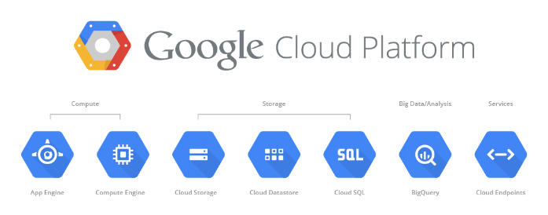

# GCP Products

GCP offers an array of powerful, scalable cloud services that allow developers to deploy, manage, and scale your applications without the hassle of dealing with physical hardware. Some of them are as follows.

[[toc]]

## 1. Compute

Google Cloud Platform (GCP) offers various compute services to run applications, virtual machines, and containerized workloads. Key offerings include [Compute Engine](#compute-engine) for virtual machines and [App Engine](#app-engine) for managed application hosting

### [Compute Engine](https://cloud.google.com/products/compute?hl=en)

Google Compute Engine offers you computing and hosting service that lets you create and run virtual machines on Google infrastructure, comparable to Amazon EC2 and Azure Virtual Machines. Compute Engine offers scale, performance, and value that lets you easily launch large compute clusters with no up-front investment.

### [App Engine](https://cloud.google.com/appengine/?hl=en)

Google App Engine lets app developers build scalable web and mobile back ends in any programming language on a fully managed serverless platform. With Google App Engine, developers can focus on writing code without worrying about managing servers, configuring infrastructure, or handling complex deployments. App Engine is also GCP serverless product.

## 2. Databases 

Google Cloud Platform (GCP) provides scalable, secure, and fully managed database services. These include [Cloud SQL](#cloud-sql) for relational databases, [Firestore](#firestore) and [Bigtable](#bigtable) for NoSQL.

### [Cloud SQL](https://cloud.google.com/sql/?hl=en)

Fully managed relational database service provided by Google Cloud Platform (GCP). It supports popular database engines, including PostgreSQL, MySQL, and SQL Server, offering the flexibility to run your applications with a familiar and widely used database infrastructure.

### [Firestore](https://cloud.google.com/firestore/?hl=en)

Fully managed, serverless, and scalable NoSQL document database provided by Google Cloud Platform (GCP). It is designed for building modern applications with real-time capabilities and seamless offline support. Firestore is ideal for mobile, web, and server-side development.

### [Bigtable](https://cloud.google.com/bigtable/?hl=en)

Cloud Bigtable is a fast, fully-managed, highly-scalable NoSQL database service. It is designed for the collection and retention of data from 1TB to hundreds of PB.

## 3. Networking

GCP's networking solutions deliver global-scale, highly secure, and performant infrastructure. Services include [Virtual Private Cloud](#virtual-private-cloud), [Cloud Load Balancing](#cloud-load-balancing), [Cloud NAT](#cloud-nat), [Cloud CDN](#cloud-cdn) for content delivery, and [Cloud DNS](#cloud-dns) for to manage your domain names.

### [Cloud DNS](https://cloud.google.com/dns/?hl=en)

Reliable, resilient, and high-performance Domain Name System (DNS) service offered by Google Cloud Platform (GCP). It provides global DNS resolution through Google’s worldwide network, enabling you to manage, publish, and serve your domain names with ease.

### [Virtual Private Cloud](https://cloud.google.com/vpc/?hl=en)

Global, isolated virtual network within Google Cloud Platform that allows you to segment and manage your resources securely. It provides a single network environment that spans across all GCP regions, enabling consistent network configuration, policy enforcement, and connectivity for all resources within your organization.

### [Cloud Load Balancing](https://cloud.google.com/load-balancing/?hl=en)

Fully managed, high-performance load balancing service provided by Google Cloud Platform. It enables you to distribute incoming traffic across multiple backend resources (such as virtual machines or containers) to ensure optimal performance, availability, and scalability for your applications.

### [Cloud CDN](https://cloud.google.com/cdn/?hl=en)

Cloud CDN uses Google's globally distributed edge points of presence to cache HTTP(S) load balanced content close to your users.

### [Cloud NAT](https://cloud.google.com/nat/?hl=en)

Fully managed, software-defined service from Google Cloud Platform (GCP) that enables virtual machine (VM) instances without external IP addresses to access the internet while maintaining security and simplicity. It provides outbound internet connectivity for private resources in Google Cloud without exposing them directly to incoming internet traffic.

## 4. Data Analytics

GCP offers powerful data analytics tools, including [BigQuery](#bigquery) for fast, serverless data warehousing, [Dataflow](#dataflow) for real-time or batch data processing, and [Looker](#looker). 

Data analytics in the cloud enables businesses and individuals to process, analyze, and derive insights from vast amounts of data efficiently and at scale without having to buy more physical hardware or manage complex infrastructure that is probably only used once and then your company won't use it anymore.

### [BigQuery](https://cloud.google.com/bigquery/?hl=en)

BigQuery is a fully-managed data analysis service that enables businesses to analyze Big Data. It features highly scalable data storage that accommodates up to hundreds of terabytes, the ability to perform ad hoc queries on multi-terabyte datasets, and the ability to share data insights via the web.

### [Dataflow](https://cloud.google.com/products/dataflow?hl=en)

Dataflow is a fully-managed service for strongly consistent, parallel data-processing pipelines. It provides an SDK for Java with composable primitives for building data-processing pipelines for batch or continuous processing. This service manages the life cycle of Compute Engine resources of the processing pipeline(s). It also provides a monitoring user interface for understanding pipeline health.

### [Looker](https://cloud.google.com/looker/?hl=en)

Looker (Google Cloud core) is a business intelligence and embedded analytics solution hosted on Google infrastructure. With Looker (Google Cloud core), customers can build semantic models using various data sources, develop customized insights from the models, and share those insights for collaboration via dashboards and other services.

## 5. AI/ML Services

GCP provides comprehensive AI and machine learning solutions, ranging from pre-trained models to custom ML development. Tools like [Vertex AI](#vertex-ai-platform) simplify building, deploying, and managing ML models, while APIs like Vision AI, Natural Language AI, and Speech-to-Text enable integration of AI into applications.

### [Vertex AI Platform](https://cloud.google.com/vertex-ai/?hl=en)

Vertex AI Platform is a service for managing the AI and machine learning development lifecycle. Customers can (i) store and manage datasets, labels, features, and models; (ii) build pipelines to train and evaluate models and run experiments using Google Cloud algorithms or custom training code; (iii) deploy models for online or batch use cases; (iv) manage data science workflows using Colab Enterprise and Vertex AI Workbench (also known as Notebooks); and (v) create business optimization plans with Vertex Decision Optimization.

## 6. Serverless

GCP's serverless solutions eliminate the need to manage infrastructure, allowing developers to focus solely on code. Services like Cloud Functions for event-driven applications and [Cloud Run](#cloud-run) for containerized workloads enable fast and scalable application deployment.

### [Cloud Run](https://cloud.google.com/run?hl=en)

Fully managed platform that enables you to run your code directly on top of Google’s scalable infrastructure. Cloud Run is simple, automated, and designed to make you more productive. Cloud Run allows you to deploy and run containerized applications written in any programming language, framework, or library. 

## 7. Storage

GCP's storage services are designed for high durability, scalability, and performance. Options include [Cloud Storage](#cloud-storage) for object storage, [Persistent Disks](#persistent-disk) for block storage, and [Filestore](#filestore) for network-attached storage

### [Cloud Storage](https://cloud.google.com/storage/?hl=en)

Managed service offered by Google Cloud Platform (GCP) for storing unstructured data such as text files, images, videos, backups, and more. It is designed for scalability, reliability, and durability, making it suitable for a wide range of use cases, from simple data storage to complex analytics workloads.

### [Filestore](https://cloud.google.com/filestore/?hl=en)

Cloud Filestore is a scalable and highly available shared file service fully-managed by Google. Cloud Filestore provides persistent storage ideal for shared workloads. It is best suited for enterprise applications requiring persistent, durable, shared storage which is accessed by NFS or requires a POSIX compliant file system.

### [Persistent Disk](https://cloud.google.com/persistent-disk/?hl=en)

Persistent Disk is a durable and high performance block storage service for Google Cloud Platform. Persistent Disk provides SSD and HDD storage that can be attached to instances running in either Compute Engine or Google Kubernetes Engine.

## 8. Container Services

GCP specializes in container management with services like [Google Kubernetes Engine](#google-kubernetes-engine) for running Kubernetes clusters and Artifact Registry for storing and managing container images. These tools streamline the deployment and scaling of containerized applications.

### [Google Kubernetes Engine](https://cloud.google.com/kubernetes-engine/?hl=en)

Fully managed Kubernetes service provided by Google Cloud Platform (GCP) that simplifies deploying, managing, and scaling containerized applications using Kubernetes. GKE allows developers to focus on application development, while Google manages the infrastructure, orchestration, and scaling of containers.