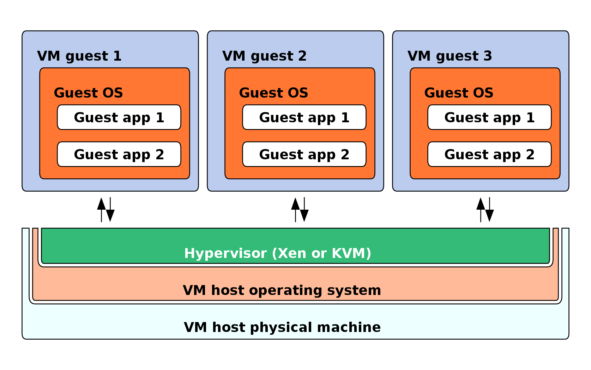
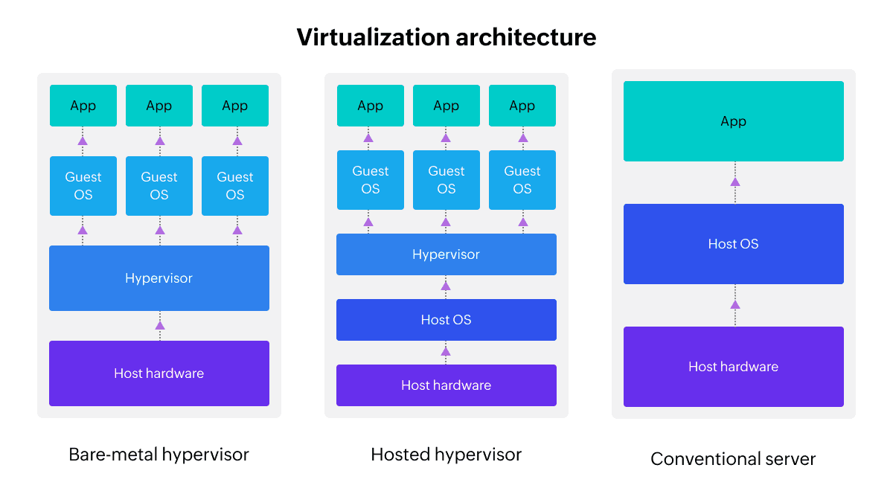

# Virtualization

Have you ever seen a computer inside a computer? If you haven't seen that, you might be wondering "How does one accomplish that?". The answer lies in **Virtualization Technology**.

## What is Virtualization

Virtualization is essentially the creation of a virtual version of something, such as a computer, storage device, or network resource, within another system. When we talk about virtualization of computers, we refer to running multiple virtual machines (VMs) on a single physical machine. With virtualization, it allows us to run multiple, independent virtual computers also known as virtual machine. Each virtual machine has its own operating system and applications, just like a physical computer, but it's running within the host machine's resources.

This is made possible through hypervisors specialized software that sits between the physical hardware and the virtual machines, managing and allocating resources such as CPU, memory and storage to each VM. There are two types of hypervisors.

1. Type 1 Hypervisor (Bare-Metal):
   Runs directly on the host's hardware without an underlying operating system. Examples include VMware ESXi and Microsoft Hyper-V. These provide high performance and are commonly used in data centers.

2. Type 2 Hypervisor (Hosted):
   Runs on top of an existing operating system. Examples include VirtualBox and VMware Workstation. These are typically used for personal or development purposes.

## Why We Use Virtualization

Why should we create a virtual computer inside a phyical computer? Who will use the virtual computer? It may sound unnecessary idea at first, but the benefits are far reaching and essential. Imagine you only have 1 server but your organization has 2 services that use different nodejs version. The first one use Node 14 and the second one use Node 22. Now you might think "How can I run both services on the same server without conflicts?". This scenario might seem tricky at first, but with virtualization, it becomes easy to manage.

::: info
For those who already know the other way, yes you can also use containerization but we will catch up to that later on
:::

### Top 5 Reasons

1. Cost Savings

   By consolidating workloads onto fewer physical servers, businesses can reduce hardware, power, cooling, and maintenance costs. Virtualization also reduces the need for additional IT infrastructure, as fewer physical machines are required to support multiple applications or services.

2. Scalability and Flexibility

   Virtualization allows businesses to quickly scale resources up or down according to their needs. Virtual machines can be created, cloned, or removed within minutes, giving organizations the flexibility to meet changing workloads and demands without the delays associated with provisioning physical servers.

3. Isolation and Security

   Virtualization provides an added layer of isolation between applications and services running on the same physical machine. This helps prevent conflicts between workloads and ensures that issues like crashes or security vulnerabilities in one VM do not affect others. Each virtual machine can be configured with its own set of permissions and security settings.

4. Environmentally Friendly

   By reducing the need for numerous physical servers, virtualization decreases the carbon footprint of IT operations. Consolidating resources onto fewer machines leads to less energy consumption, cooling requirements, and waste, making it a more sustainable option for businesses.

5. Faster Deployment and Testing:

   Virtualization enables faster deployment of new systems and applications. Developers can create isolated environments for testing and development without impacting production systems. This allows for quick experimentation, troubleshooting, and updates without the need to provision new hardware.
