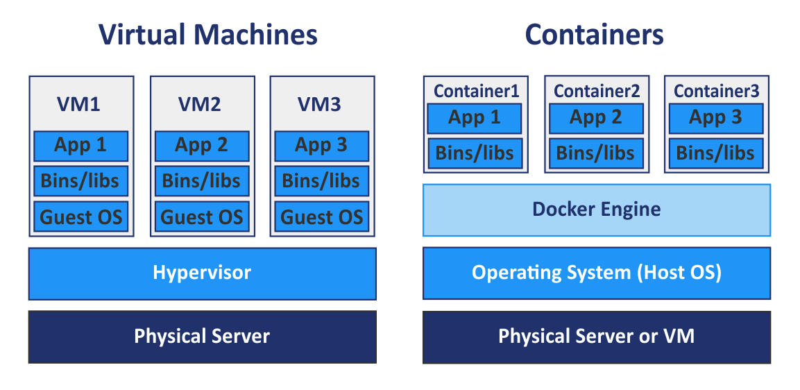
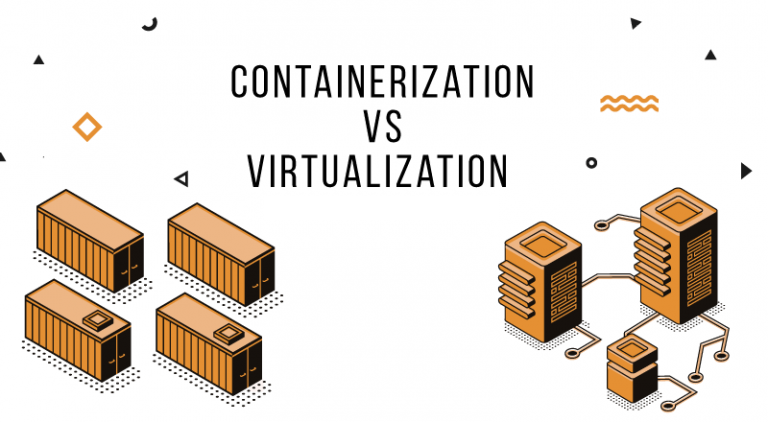
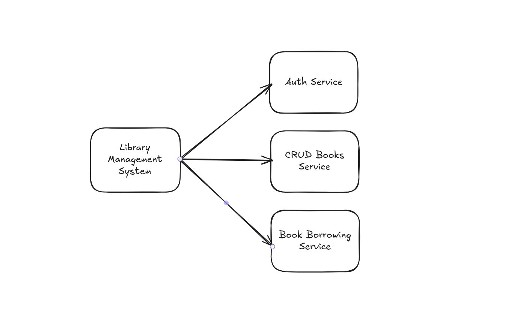

# Virtualization vs Containerization

## So What's the Difference?

Both of them allows us to create an isolated enviroment to test, run and ship our application to the internet. But what makes them different? Let's take a look at 2 major key differences that separates them.

### 1. Isolation

Virtualization offers hardware level isolation, meaning each virtual machine runs its own full OS, making them more isolated from each other and even from the host. Virtual machines are generally considered more secure because they are fully isolated from each other at both the OS and hardware level.

Containerization offers process level isolation, meaning applications are isolated from each other at the process level, but they share the same OS kernel. Since they share the same kernel, they don't have the same level security as the virtualization.

### 2. Resource Usage

Virtualization is more resource intensive as they require full operating system to run and emulate hardware for each instance. They tend to have higher resource overhead because each VM includes a full OS and all its necessary components.

Containers are more efficient in resource usage because they share the host OS and only run the application and its dependencies. They start quickly and use less memory as they don’t require a separate OS for each container.

## Why We Prefer Containerization Over Virtualization

While both of them allows us to create an isolated environment to run multiple application in the same physical server, containerization offers serveral key advantages that makes it a preferred choice in today's computing environments. Here's why.

1. Resource Efficiency

   In virtualization, every virtual machine needs full operating system to operate. This means multiple VMs need their own operating system which concludes that it will consume a lot of CPU, memory dan storage. On the other hand, in containerization, each containers doesn't need full operating system. It will simply use the host operating system kernel to run multiple containers. Each container share the same OS kernel but runs in an isolated environment.

2. Faster Startup and Scalling

   Try to boot up your VM. At the same time, spin up a container. You will quickly notice the huge differences when we try to running both of them. Virtual machine takes a longer time to boot because the entire operating system must be loaded each time we start the VM. On the other hand, containers are much faster because they only need to start the application within the container without needing to boot the enitre operating system.

3. Portability

   Both containers and virtual machines offer a high degree of portability. However, containers have a slight edge because they package the application and all of its dependencies together into a single unit, which can be run on any system that supports the container platform. Virtual machines, while also portable, are more dependent on the underlying hardware and operating system.

4. Scalability

   The lightweight nature and rapid startup time offered by containers make them ideal for scaling applications quickly and efficiently. Virtual machines, while also scalable, are more resource-intensive and take longer to start, making them less suitable for microservices and distributed applications.

## Use cases

While from the previous point it seems like "Why would we use Virtualization when there's Containerization which is more lightweight". Both of them have their own strong use cases.

## Virtualization Use Cases

### Strong Isolation

Virtualization excels in environments where strong isolation between applications is critical. This is particularly useful in high-security environments, where a breach in one application should not be able to affect others.

### IaaS

Infrastructure as a Service is a cloud computing model where resources like virtual machines, storage and networks are provided as a servivces. Virtualization is the core technology behind IaaS. It allows cloud providers to efficiently utilize their hardware resources by running multiple VMs on the same physical hardware. Several examples of IaaS in GCP are [Google Compute Engine](https://cloud.google.com/products/compute?hl=en), [Google Cloud Storage](https://cloud.google.com/storage/?hl=en) and [Google Cloud DNS](https://cloud.google.com/dns/?hl=en)

## Containerization Use Cases

### Microservice Architecture

In a microservices architecture, an application is broken down into small, independent services that communicate with each other.

For example let's say you have a Library Management System. The system can be split into several microservices.

1. It can create, update and delete a book into the database.
2. A new user can register and login to the system
3. User can borrow the book and return the book to the library.

Containers are a perfect fit for microservices. They provide a standardized environment for each service, ensuring that they run consistently across different platforms.

### PaaS

Platform as a Service (PaaS) is a cloud computing model where a provider delivers a platform for developers to build, test, and deploy applications. This platform typically includes an operating system, middleware, and runtime environment. Containerization is an integral part of PaaS. It allows providers to efficiently utilize their resources by running multiple containers on the same host. Several examples of PaaS in GCP are [App Engine](https://cloud.google.com/appengine/?hl=en), [Cloud Run](https://cloud.google.com/run?hl=en) and [Google Kubernetes Engine](https://cloud.google.com/kubernetes-engine/?hl=en)
