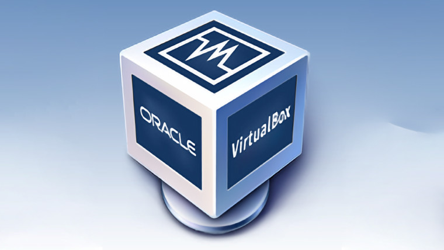

# Introduction with Virtual Box

Now before we get to the hands on creating your first virtual machine. We also need the required tools to download so we can create our virtual machine. But with what software will we use to create virtual machine? There are many softwares to help us create VM but we will use VirtualBox, which is a type 2 hypervisor. 

## What is Virtual Box

VirtualBox is a free and open-source virtualization software that allows you to create and manage virtual machines (VMs) on your personal computer. Unlike Type 1 hypervisors, which run directly on the hardware, VirtualBox is a Type 2 hypervisor, meaning it runs on top of an existing operating system (such as Windows, macOS, or Linux) and utilizes the host system's resources to create virtual environments.

With VirtualBox, you can run multiple operating systems on your computer simultaneously, without altering or interfering with the host operating system. It is ideal for developers, testers, or anyone looking to experiment with different operating systems or applications without needing dedicated hardware for each system.

