# Tools Installation

[[toc]]

## Virtual Box

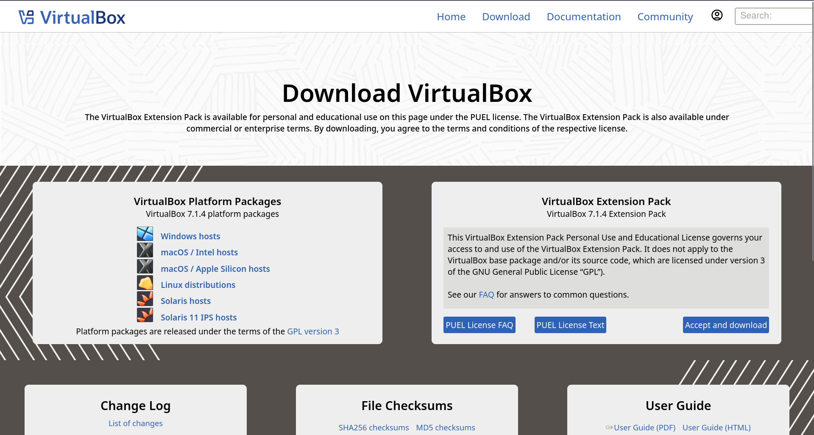

1. To download virtual box, you can visit [VirtualBox Download Link](https://www.virtualbox.org/wiki/Downloads) and then the above image will show up.
2. Choose platform package based on your PC operating system and then click the download link.
   - If your PC OS is MacOS but with Intel CPU, then choose macOS/Intel hosts
   - If your PC OS is MacOS but with Apple Sillicon CPU, then choose macOS/Apple Sillicon hosts
3. After the process of downloading installer is done, launch the installer by clicking the file, it will show up like this
   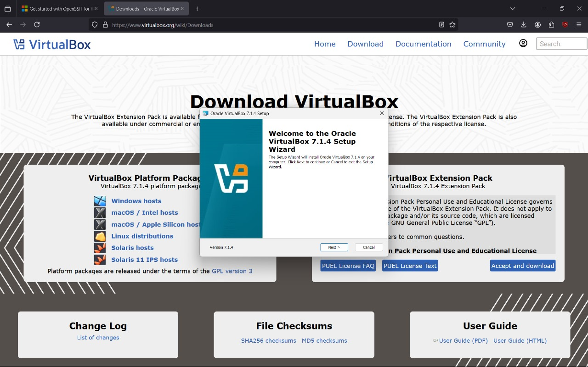
4. Click next and agree to ToA
5. Here you can change the software location or leave as it is
   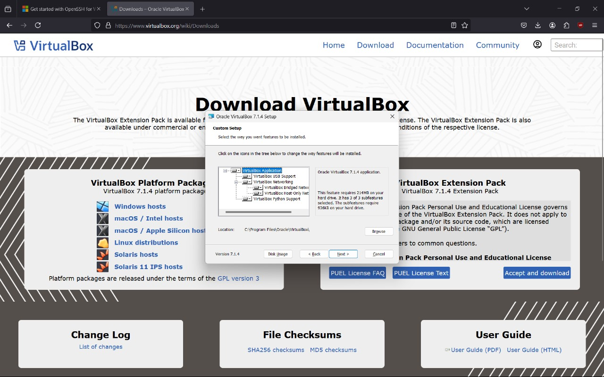
6. If the below warning shows up, just proceed with the installation and click yes
   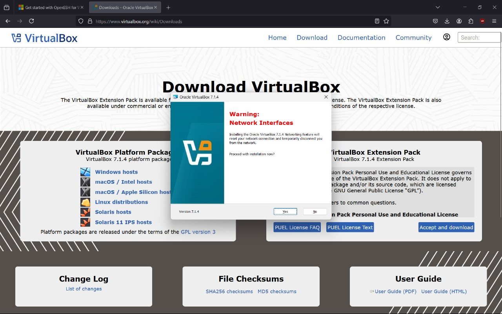

::: tip INFO
You can skip step 7 - 9 and directly go to step 10 if your installer doesn't give you warning about `Missing Dependancies Python Core / win32 api` like the step 7 image
:::

7. If the installer says `Missing Dependancies Python Core / win32 api` like the below image, then you can download and install python first through [this link](https://www.python.org/downloads/release/python-3127/) then add python installation directory to the path variable by accessing it through system environment variables. For more clarity, you can watch the guide in this [youtube video](https://www.youtube.com/watch?v=91SGaK7_eeY) or just ask us in the whatsapp group
   
8. Then check if python is already installed or not by running the following command in your terminal

```zsh
python --version
```

It should show up like this
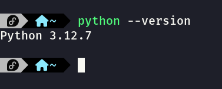 9. Then we need to install python win32 api by running the following command in your terminal

```zsh
pip install pywin32
```

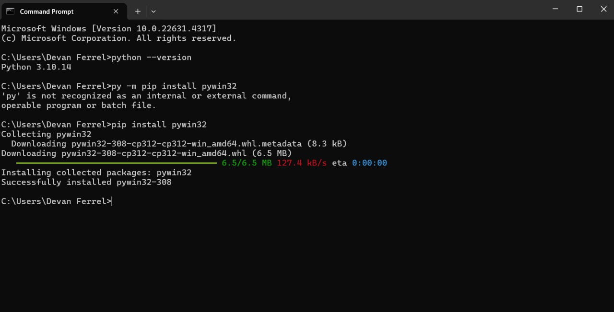 10. If everything went well, close the virtualbox installer then run the installer again, click next and choose the software location, then after that, there should be no more warning missing dependancies and it should show this instead
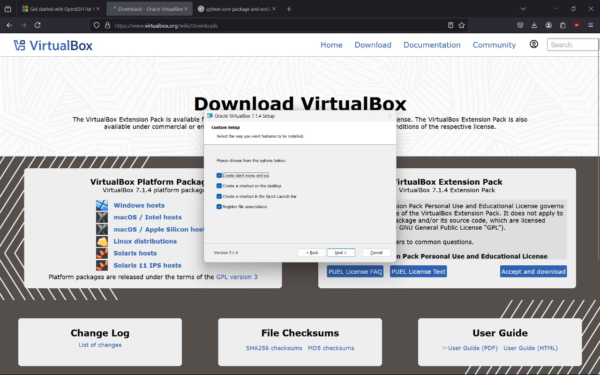 11. Just hit next and tadaaa, virtualbox is already installed in your computer! 🥳
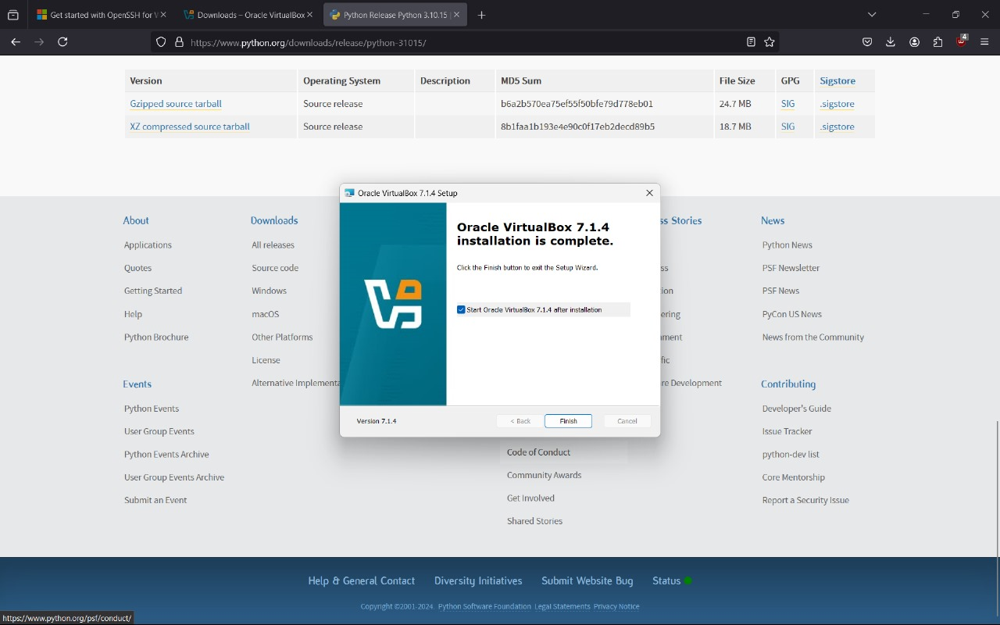 12. Launch the virtualbox software and horayy, we are done with virtualbox 🎉
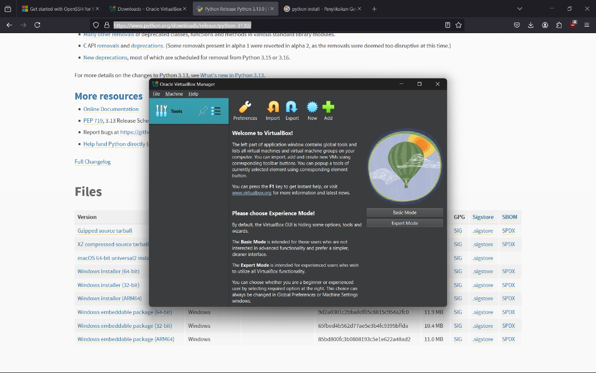

## Ubuntu Server

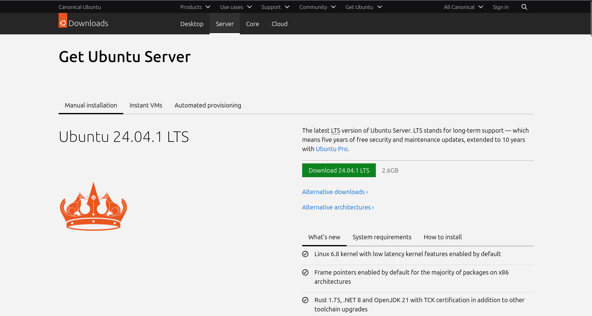

To create virtual machine inside our computer, of course we need an operating system. For this one, we will use linux, specifically ubuntu server.

### So What is Linux?

Linux is an open source operating system developed by Linus Torvalds in 1991. Linux is known for its reliability, security, and flexibility, making it widely used in personal devices, servers, and cloud environments. Linux has many distributions or what we call "distros" which are variations of linux that bundle the kernel with additional software to create complete operating system. One of the most popular distro is Ubuntu. Ubuntu itself is open source and free, lightweight and includes a vast repository of software packages and tools for server management, web hosting, and application deployment.

### Download Ubuntu Server

1. To download ubuntu server ISO, you can visit [Ubuntu Sever ISO Download Link](https://ubuntu.com/download/server) and the above image will show up.
2. Click the green download button and it will begin downloading the Ubuntu Server ISO
   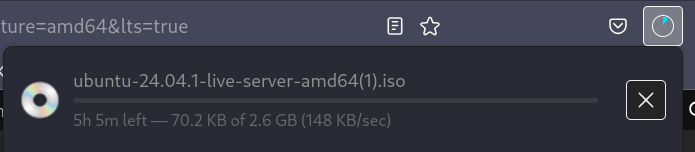
3. If the process of download ubuntu server iso is done, we will begin create our virtual machine

## Git


Since we are going to deploy a web application, we need to find a way for our server to access the source code of the web application. One of the most common and efficient ways to achieve this is by using [Git](https://git-scm.com/) to get the application source code that is usally hosted in a [Github](https://github.com/) repository.

### What is Git?

Git itself is a version control system that keeps track of all changes to the codebase, making it easy to manage updates and revert to previous versions if needed. With git, it can access and clone any applications source code that are hosted in GitHub, GitLab dan BitBucket.

### Install Git

::: tip INFO
Actually for this section, you must have a virtual machine with ubuntu distro already. You can come back to this section again once you already have a virtual machine.
:::

We will use git to clone our application source code that is hosted in github repository. To check if your virtual machine already has git installed, you can simply run the following command.

```zsh
git --version
```

It should give you output like the following image

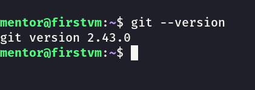

If it doesn't give you that but instead something like `Command git not found`, you can install git in your virtual machine by running the following command

```zsh
sudo apt-get install git -y
```
