# Tools Installation

## Virtual Box

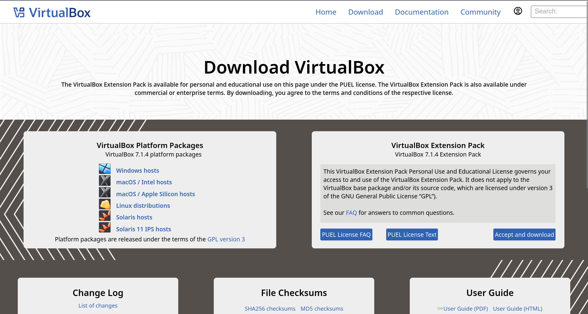

1. To download virtual box, you can visit [VirtualBox Download Link](https://www.virtualbox.org/wiki/Downloads) and then the above image will show up.
2. Choose platform package based on your PC operating system and then click the download link. 
    - If your PC OS is MacOS but with Intel CPU, then choose macOS/Intel hosts
    - If your PC OS is MacOS but with Apple Sillicon CPU, then choose macOS/Apple Sillicon hosts
3. After the process of downloading installer is done, launch the installer by clicking the file, it will show up like this
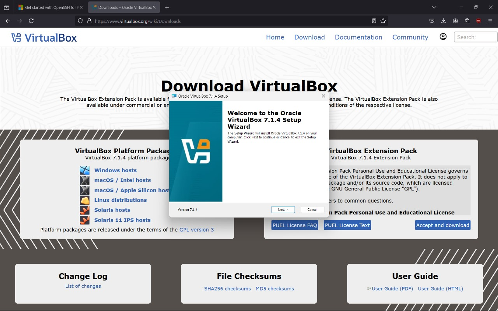
4. Click next and agree to ToA
5. Here you can change the software location or leave as it is
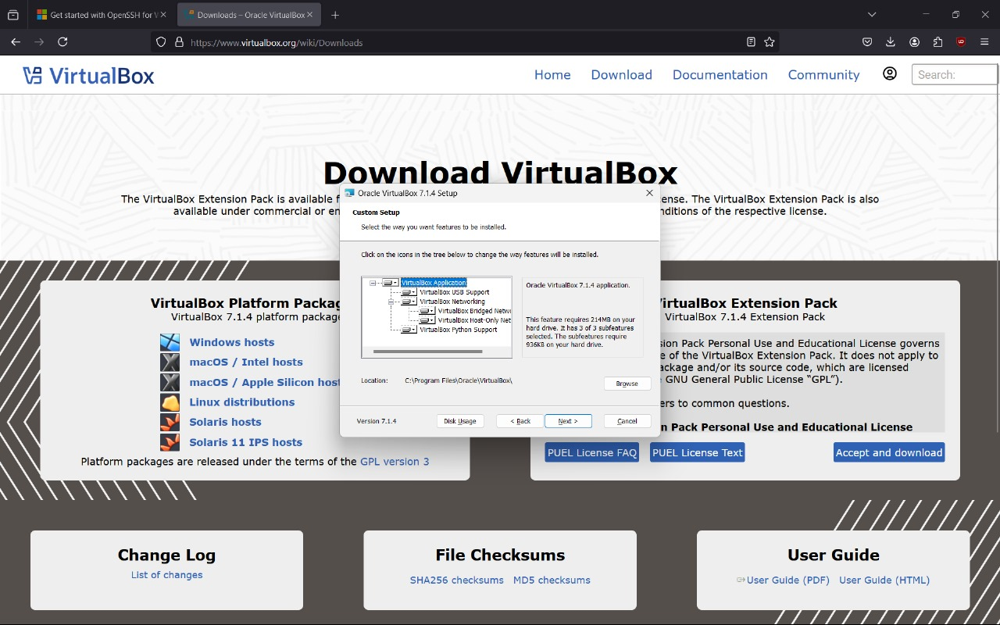
6. If the below warning shows up, just proceed with the installation and click yes
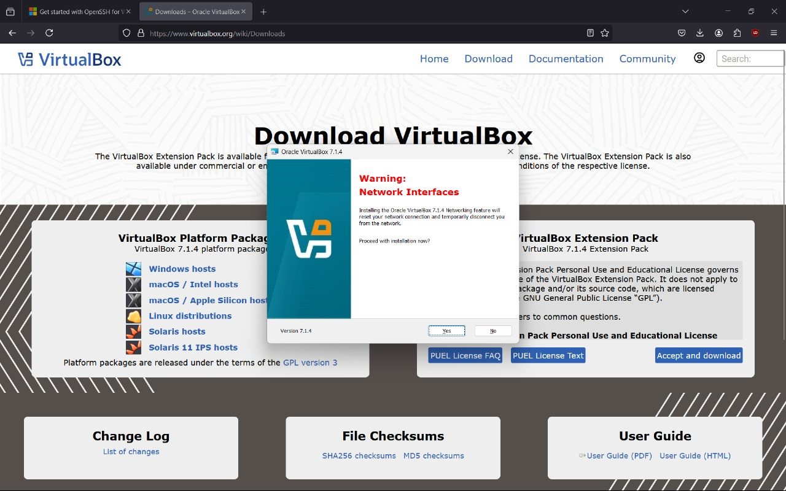
7. If the installer says "Missing Dependancies Python Core / win32 api", then you can download and install python first through [this link](https://www.python.org/downloads/release/python-3127/) then add python installation directory to the path variable by accessing it through system environment variables. For more clarity, you can watch the guide in this [youtube video](https://www.youtube.com/watch?v=91SGaK7_eeY) or just ask us in the whatsapp group

8. Then check if python is already installed or not by running the following command in your terminal
```zsh
python --version
```
It should show up like this
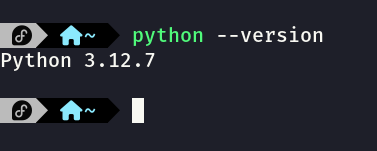
9. Then we need to install python win32 api by running the following command  in your terminal
```zsh
pip install pywin32
```
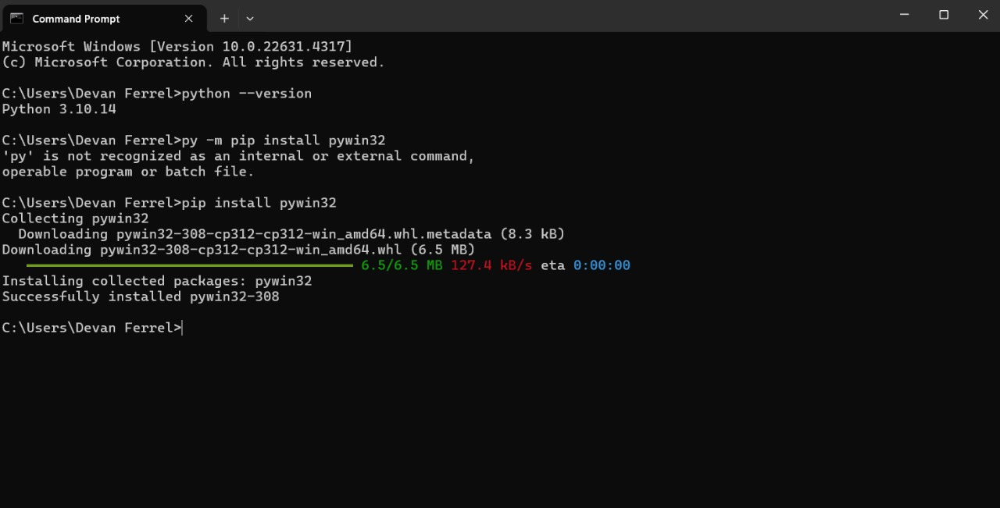
10. If everything went well, close the virtualbox installer then run the installer again, click next and choose the software location, then after that, there should be no more warning missing dependancies and it should show this instead
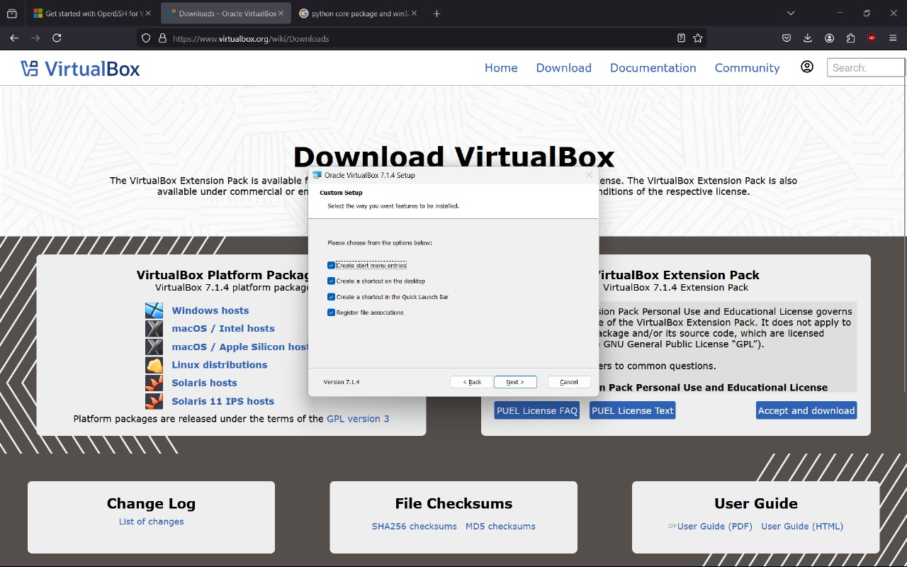
11. Just hit next and tadaaa, virtualbox is already installed in your computer! 🥳
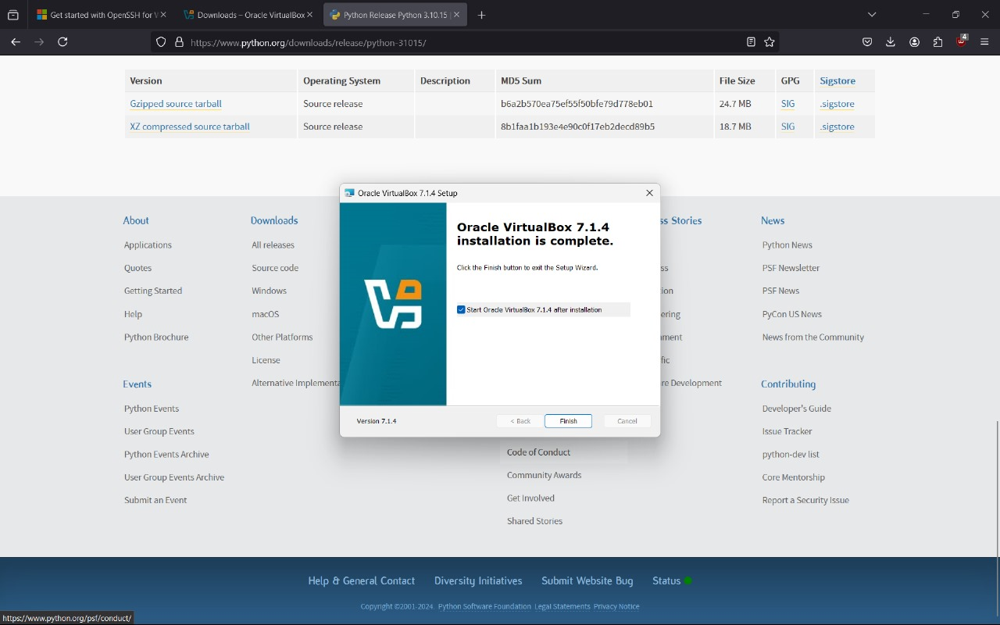
12. Launch the virtualbox software and horayy, we are done with virtualbox 🎉
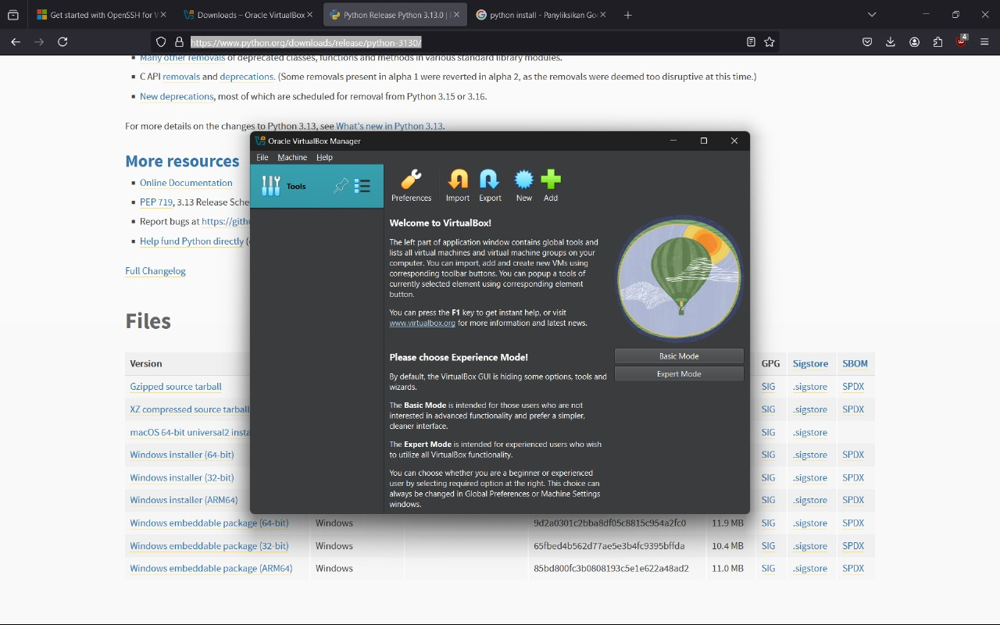

## Ubuntu Server 

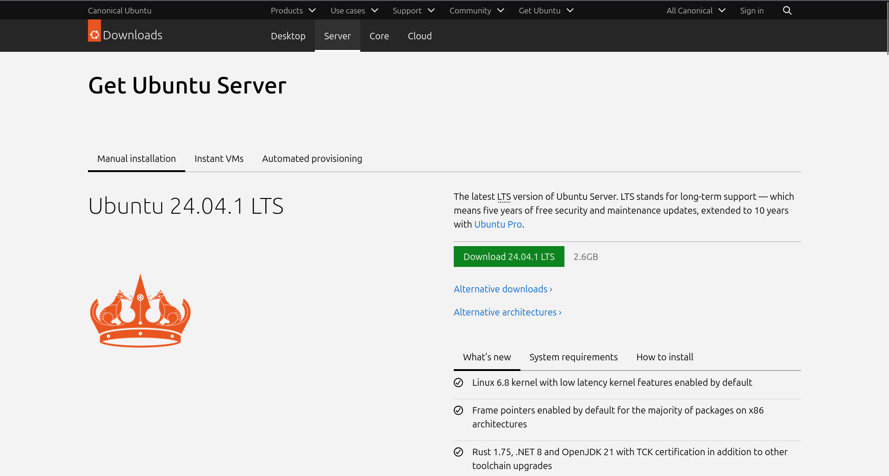

1. To download ubuntu server ISO, you can visit [Ubuntu Sever ISO Download Link](https://ubuntu.com/download/server) and the above image will show up.
2. Click the green download button and it will begin downloading the Ubuntu Server ISO
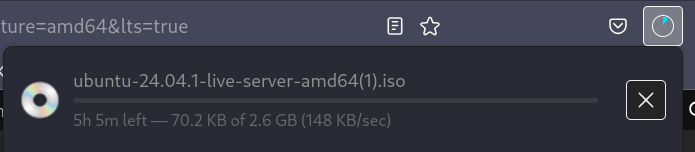
3. If the process of download ubuntu server iso is done, we will begin create our virtual machine