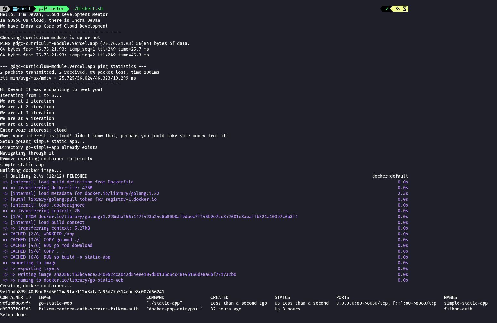
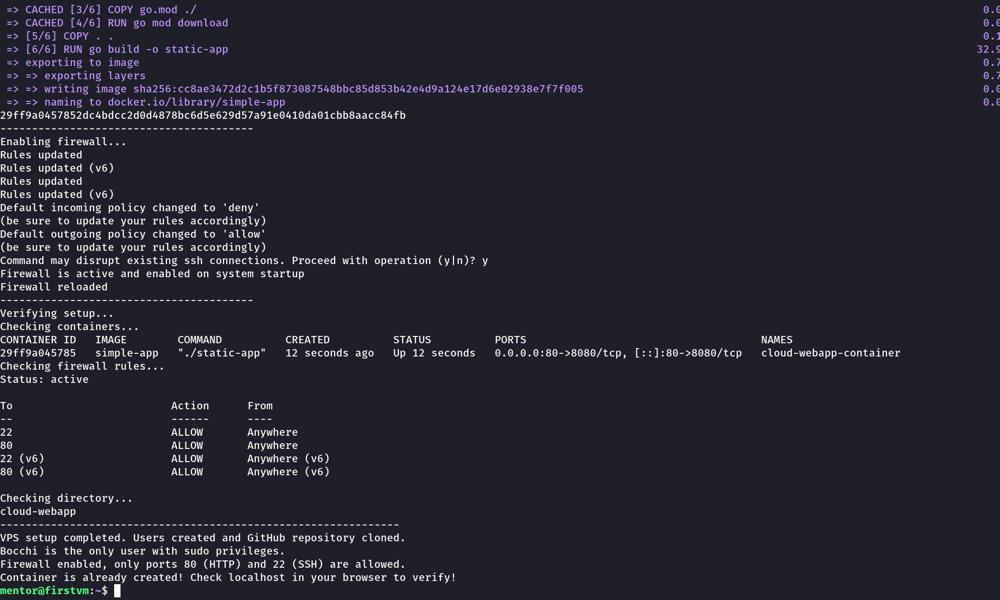

# Shell Scripting


In Linux, you can create a script that will run bunch of linux commands sequentially. We called it shell scripting. Now why would we do that? 

Let's just say every time you want to setup a VPS ready for deployment, you want to setup the ssh server, firewall, docker installation and many more. Manually performing by running the command one by one every time can be tedious and prone to errors. By writing shell script, you can automate all of those tasks and perform all of those tasks by running a single command. Once written, the script can be reused on any server setup, reducing repetitive work and simplifying server provisioning. This makes shell scripting a powerful tool for system administrators and developers.

## Script Structure

Typically, every shell script has structure like these.

1. Shebang Line
```bash
#!/bin/bash
```
Shebang line states which interpreter or shell that will execute the script. Each shell or interpreter has different syntax. To check available shell in your linux machine, you can perform this command.
```zsh
cat /etc/shells
```

2. Defining variables

In shell scripting, you can define variables like this

```bash
# You can define variables like these
name=Devan
names=("Indra" "Devan") # for array
```

3. Accessing Varibales

Everytime you want to access variables, you have to use dollar sign $ and then type the variable name.

```bash 
# To use and access them, you can use dollar sign $ like below
echo "Hello, I'm $name, Cloud Development Mentor"

# To print an entire array
echo "In GDGoC UB Cloud, there is ${names[@]}"
```

4. You can also execute other linux command in here

```bash
ping gdgc-curriculum-module.vercel.app -c 2 
sudo ufw status
sudo systemctl status ssh
```
5. Control Structure (If-Else)

To define control flow, you can use this syntax

```bash
if [ "$name" == "Devan" ]; then
  echo 'Hi Devan! It was enchanting to meet you!'
else
  echo 'Hello stranger! Nice to meet you!'
fi
```
6. Looping

There are many form of for loops in shell scripting. Here are few examples of them

```bash
# simple for loop
for i in {1..5}; do 
    # do something
done

# foreach array
for name in ${names[@]}; do 
    # do something
done

# while loop
count=1
while [ $count -le 5 ]; do
    echo "Count is $count"
    ((count++)) # Increment the count
done

# until loop, executes as long as the condition is false
count=1
until [ $count -gt 5 ]; do
    echo "Count is $count"
    ((count++)) # Increment the count
done

```

7. Break and Continue

To break or continue iteration in looping, you can use this syntax.

```bash
for i in {1..10}; do
    if [ $i -eq 5 ]; then
        break # Exit the loop when i is 5
    fi
    if [ $i -eq 2 ]; then
        break # Continue to next iteration when i is 2
    fi
    echo "Number: $i"
done
```

8. Functions

To create function or method in shell scripting, you can use these syntax

```bash
greet() {
    echo "Hello, world!"
}

# call the function
greet
```

9. Parameters
When running shell script, you can give parameters directly from command line


```bash
#!/bin/bash

# Function definition with a default value
greet() {
    local name=${1:-"Guest"}  # Default value is "Guest" if no argument is provided
    echo "Hello, $name!"
}

# Calling the function with and without an argument
greet "Devan" # will print Hello Devan
greet # will print Hello Guest

# Function definition with multiple parameters
print_params() {
    echo "You passed the following parameters:"
    for param in "$@"; do
        echo "$param"
    done
}

# Calling the function with multiple arguments
print_params "one" "two" "three" "four"

```

## Example Script
```bash
#!/bin/bash
# Above is a Shebang line, states which interpreter should execute the script (bash, sh, zsh, fish, and other shell)
# Shebang line must be in the first line of the script

# You can define variables like these
name=Devan
names=("Indra" "Devan") # for array

# To use and access them, you can use dollar sign $ like below
echo "Hello, I'm $name, Cloud Development Mentor"

# To print an entire array
echo "In GDGoC UB Cloud, there is ${names[@]}"

# To access a specific element from array, index starts from 0 to length - 1
echo "We have ${names[0]} as Core of Cloud Development"

# You can pause the program with sleep command
# Below means the program will sleep for 1 second
sleep 1

# You can also execute other linux command in here
# For example, heres the command to ping curriculum module
echo '-----------------------------------------------'
echo 'Checking curriculum module is up or not'
ping gdgc-curriculum-module.vercel.app -c 2
echo '-----------------------------------------------'

# Control structure looks like this
# below is to check if name variable equals to Devan or not
if [ "$name" == "Devan" ]; then
  echo 'Hi Devan! It was enchanting to meet you!'
else
  echo 'Hello stranger! Nice to meet you!'
fi

sleep 1

# Here we run a simple for loop
# notes: each interpreter has different syntax of for loop
#        make sure to check them in documentation
# Looping from 1 until 5, inclusively
echo "Iterating from 1 to 5..."
for i in {1..5}; do
  echo "We are at $i iteration"
done

sleep 1

# If you want to handle user input, you can use read command
read -p "Enter your interest: " interest

# doing while loop with condition if string is empty or not
while [ -z "$interest" ]; do
  echo "Your interest can't be empty!"
  echo "You must have an interest to achieve your true self"
  read -p "Enter your interest: " interest
done

echo "Wow, your interest is $interest! Didn't know that, perhaps you could make some money from it!"

# Lets say we want to quit the program if their interest is Frontend
if [ "$interest" == "Frontend" ]; then
  echo "Im sorry, we don't accept Frontend developers here."
  exit 1
fi

# To define functions or methods, you can define it like below
setup_static_app() {
  app_dir="go-simple-app"
  app_image_name="go-static-web"
  container_name="simple-static-app"

  echo "Setup golang simple static app..."

  # Check if directory already exists or not
  if [ -d "$app_dir" ]; then
    echo "Directory $app_dir already exists"
    echo "Navigating through it"

    cd "$app_dir"

    # Check if file Dockerfile doesn't exists
    if [ ! -f "Dockerfile" ]; then
      echo "Can't find file Dockerfile"
      echo "Exiting..."
      exit 1
    fi

    echo "Remove existing container forcefully"
    docker container rm "$container_name" -f

  else
    echo "Directory doesn't exists"
    echo "Cloning the github repo..."

    git clone https://github.com/gdgc-ub/cloud-simple-dockerfile-study.git "$app_dir"
    cd "$app_dir"

  fi

  echo "Building docker image..."
  docker build -t "$app_image_name" .

  echo "Creating docker container..."
  docker run -d --name "$container_name" -p "80:8080" "$app_image_name"

  docker container ls

  echo "Setup done!"
}

# To call the method or function, just type the function name
setup_static_app

```
::: tip INFO
Make sure you access your server through SSH to make copy paste code easier 
:::

Now let's execute the script above! 

1. To run them, you neet to create a file called ```hishell.sh```

```zsh
touch hishell.sh
```

2. After that, we use vim as our terminal code editor. You can use other options like nano or VSCode SSH but more often, you will use either nano or vim to code directly in terminal.

```zsh
vim hishell.sh
```

3. After you enter vim, enter vim's insert mode by pressing ```i``` key

4. Copy the above code and paste to vim by using ```Ctrl + Shift + V```

5. Exit from vim's insert mode by pressing ```Esc``` key

6. Save the file with the code you have written by pressing ```Ctrl + Shift``` then type ```wq``` key and it should save and exit

::: tip INFO
In vim, if you want to only save without quit, just type ```w``` key. If you want to quit without save, type ```q!``` key.

Before typing that key, make sure you already press ```Ctrl + Shift```
:::

7. Modify shell script to be executeable by running ```chmod``` command

```zsh
chmod +x hishell.sh
```

8. Execute the script by running it like this

```zsh
./hishell.sh
```

9. It should display like this




## Study Case


Our senior devops engineer needs you as a system administrator to setup a VPS for a team called Cloud. The team consist of Dengklek, Bocchi, Made and Asep. The senior want each person has their own linux user in the VPS. The password for each user is password-i where i is the iteration variable. Each linux user is also a part of linux group called cloud. The senior want you to clone a github repository that you can find in this [github repository](https://github.com/gdgc-ub/cloud-simple-dockerfile-study) to directory ```/home/cloud/projects/cloud-webapp```. The only people and groups who can read, modify and execute are the people in cloud groups. Other than are denied for modify and. Bocchi as the leader of Cloud Group is the only one wbo can run as sudo user.

Not only that, for security reasons, the senior also wants you to enable firewall and only allow access to port 80 (HTTP) and 22 (SSH). This will ensure that only essential services (web and SSH) are accessible, and all other ports are blocked for external access.

The senior also wants you to automate the docker image build process with Dockerfile inside ```/home/cloud/projects/cloud-webapp```, give the image tag simple-app and create container with that image.

Since our senior devops engineer have a patience as thin as a tissue, he needs you to write the shell script with filename ```setup-vps.sh``` within 1 hour. Also since the senior is the believer of clean code, he wants you to separate those codes into 5 functions, create_user_and_group, clone_git_repo, modify_permission, enable_firewall and build_and_run_docker. Can you complete the task?

Ofcourse you can! Here's the step by step to complete the above task.

1. Create a file called ```task.sh```

```zsh
touch setup-vps.sh
```

2. Edit it with our favorite terminal code editor, vim

```zsh
vim setup-vps.sh
```

3. Define the shebang to use bash interpreter 

```bash
#!/bin/bash
```

:::tip  INFO

You can use other interpreter like sh, zsh, fish and others but be cautious of different syntax
:::


4. Now we need to define a function called ```create_user_and_group```

```bash
create_user_and_group() {
    echo "----------------------------------------"
    echo "Creating users and group..."
}
```

5. Inside the function block, we need to define array of users

```bash
users=("Dengklek" "Bocchi" "Mate" "Asep")
```

6. We need to create linux group called ```cloud```

```bash
sudo groupadd cloud
```

7. After that, we create user and assign them to cloud group with passwords
```bash 
for i in {1..4}; do 
    password="password-$i"

    # create the user with home directory and a default shell using bash
    sudo useradd -m -s /bin/bash "$user"

    # modify the user by adding them to cloud group
    sudo usermod -aG cloud "${user[$i]}"

    # set password for each user
    echo "${user[$i]}:$passsword" | sudo chpasswd
fi 

# add bocchi to sudo
sudo usermod -aG sudo Bocchi
```

8. After finishing the ```create_user_and_group``` function code, define another function called ```clone_git_repo```
```bash
clone_git_repo() {
    echo "----------------------------------------"
    echo "Cloning github repository..."
}
```

9. Inside the block, we create the directory and clone the repository

```bash
sudo mkdir -p /home/cloud/projects
sudo git clone https://github.com/gdgc-ub/cloud-simple-dockerfile-study.git /home/cloud/projects/cloud-webapp
```

10. After finishing ```clone_git_repo``` method, define another function called ```modify_permission```

```bash
modify_permission() {
    echo "----------------------------------------"
    echo "Modify directory permission...
}
```

11. Inside it, set the permission for the repository only for cloud group.

```bash
sudo chown -R :cloud /home/cloud/projects/cloud-webapp
sudo chmod -R 775 /home/cloud/projects/cloud-webapp
```

::: tip INFO
The -R flag in many Linux commands, such as chmod, chown, and setfacl, means recursive. When applied, it instructs the command to operate not only on the specified directory but also on all its subdirectories and files.
::: 


12. Next, we are going to complete another function ```enable_firewall``` 
```bash
enable_firewall() {
    echo "----------------------------------------"
    echo "Enabling firewall...
}
```

13. Allow SSH (port 22) and HTTP (port 80) traffic
```bash
sudo ufw allow 22
sudo ufw allow 80
```

14. Deny all incoming connections by default
```bash
sudo ufw default deny incoming
sudo ufw default allow outgoing
```

15. Enable Firewall and reload the firewall to apply changes
```bash
sudo ufw enable
sudo ufw reload
```

16. Next, we are finishing our script with our last function called ```build_and_run_docker```

```bash
build_and_run_docker() {
    echo "----------------------------------------"
    echo "Building and creating container...
}
```

17. Inside the function block, we need to navigate first to the project directory
```bash
cd /home/cloud/projects/cloud-webapp
```

18. Then build and create contianer that forward the VPS port 80 to container port 8080
```bash
sudo docker build -t simple-app .

sudo docker run -d --name cloud-webapp-container -p 80:8080 simple-app
```

19. Create another function called ```verify_setup``` to display all containers and firewall rules

```bash
verify_setup() {
    echo "----------------------------------------"
    echo "Verifying setup..."

    echo "Checking containers..."
    sudo docker container ls

    echo "Checking firewall rules..."
    sudo ufw status
    
    echo "Checking directory..."
    ls /home/cloud/projects
}
```

20. Outside the function scope, we call all functions we already defined

```bash
create_user_and_group
clone_git_repo
modify_permission
build_and_run_docker 
enable_firewall 
verify_setup
```


21. Finally, we give some confimration message
```bash
echo '---------------------------------------------------------------'
echo "VPS setup completed. Users created and GitHub repository cloned."
echo "Bocchi is the only user with sudo privileges."
echo "Firewall enabled, only ports 80 (HTTP) and 22 (SSH) are allowed."
echo "Container is already created! Check localhost in your browser to verify!"

```

22. After you're done writing the script, escape vim's insert mode by type ```Esc``` key.

23. Save and quit by typing ```Ctrl + Shift + :``` then type ```wq``` key and enter.

24. Make the script to be executeable by running the following command

```zsh
chmod +x setup-vps.sh
```

25. Run the script
```zsh
./setup-vps.sh
```
25. If the terminal give you output like this... Voilaa! You already finished the task!



::: tip INFO
If you want to do cleanup all things that has been done from previous script, you can run bellow command

```zsh
# Download the cleanup script
curl -o cleanup.sh https://raw.githubusercontent.com/gdgc-ub/shell-scripting/refs/heads/master/cleanup.sh

# Make it executeable
chmod +x cleanup.sh

# Run the script
./cleanup.sh
```
:::

All codes can be found in [GDGoC UB Shell Scripting Repository](https://github.com/gdgc-ub/shell-scripting)