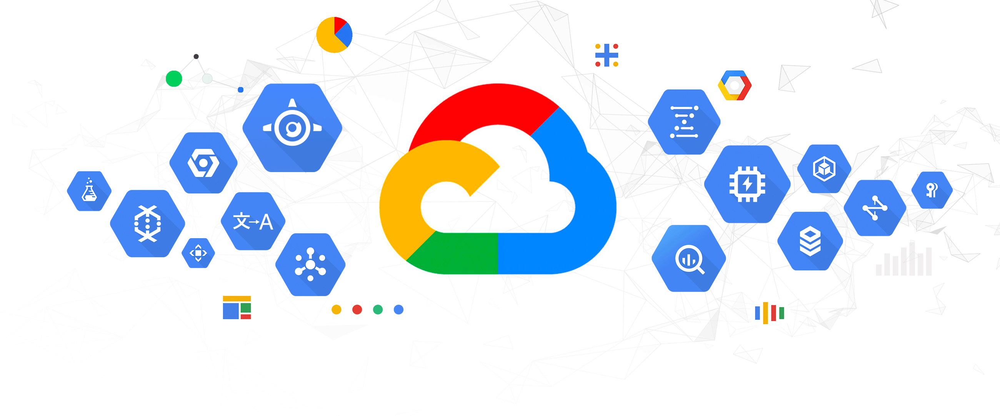

# Google Cloud Platform

## Why Google Cloud Platform

In today's fast-paced digital era, developers and businesses need reliable tools to build, scale, and manage their applications efficiently. They also want to quickly scale their infrastructure without spending excessive time and effort maintaining hardware. Imagine, you’re also part of them, and you want to deploy your application so your friends, your professor, and your parents can see your simple CRUD application. 

At first, it seems simple. "Lemme just buy a server, set up the network, the hardware, the software and host it all by myself". So you purchase a $100 server and start configuring it. But then, something unexpected happens. Your simple CRUD app goes viral, and now, millions of users are accessing your app simultaneously. Everything went messy because your server is struggling to keep up with the load and you find yourself struggling to scale it quickly.

At this point, you realize that managing hardware, network and server maintenance not only costly but also incredibly time consuming. This is where **Google Cloud Platform (GCP)** comes to the rescue. 

## What is Google Cloud Platform

Google Cloud Platform (GCP) is a cloud computing service provided by Google that offers secure, reliable, scalable and high performance cloud services that allow you to deploy, manage and scale your application without the hassle of deadling with physical hardware. Instead of worrying about hardwares, networks and maintenance, you can focus on what truly matter, building and improving your application.

With GCP, you can automatically scale your resources based on demand, ensure that your application remains available with global load balancing. Whether you’re running a small CRUD app or managing a massive enterprise system, GCP allows you to deploy efficiently and scale as needed without the burden of managing physical servers. The perfect solution for developers and businesses looking to grow their apps while keeping infrastructure management simple and cost effective.