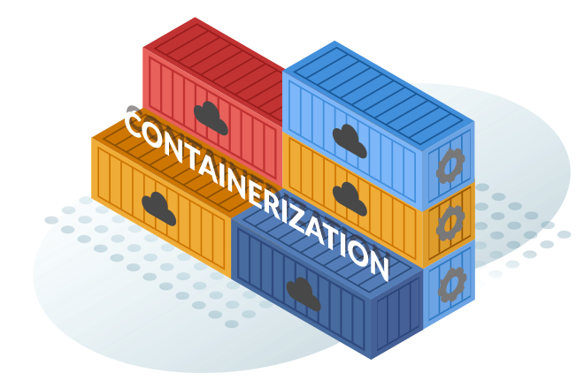

# Containerization

Another day another job as an infra guy. Suddenly, your co-worker said he urgently needs another VM in the server to run a service that use PHP 5 for some reason. You go to the server VM management and tries to spin up another virtual machine but then the VM management software alerts you with "not enough resource to create another VM". Your hands become sweaty and a sinking feeling creeps up. You begin to questioning if there is an alternative way to run a service in an isolated environment without the heavy overhead of VMs. 

There in fact exists another technology that lets you do that. It's called **Containerization**

## What is Containerization

Containerization is a lightweight form of virtualization that allows you to package applications with dependancies required to run the code to create a single lightweight executeable a container that runs consistently on any infrastructure. Unlike VMs, containers don't need a full operating system. They share the same underlying kernel of the host OS but operates in an isolated user-space environment where it runs the application with its dependancies and libraries.

## How Containerization Works

So how do we create a container? To simply put, to create one, we need container image. Container image is essentially the blueprint or template used to create a container. It contains everything you needed to run the application. Container image is like those software executables where you bundle all the necessary files and instructions needed to run a program into a single package. But then wait a second. If in virtualization, there is hypervisor who manages VMs resources then who manages containers resource and lifecycle? Well we have container engine. Container engine responsible for managing the entire container lifecycle. The most popular container engine is [Docker](https://www.docker.com/) which we will learn later on.

