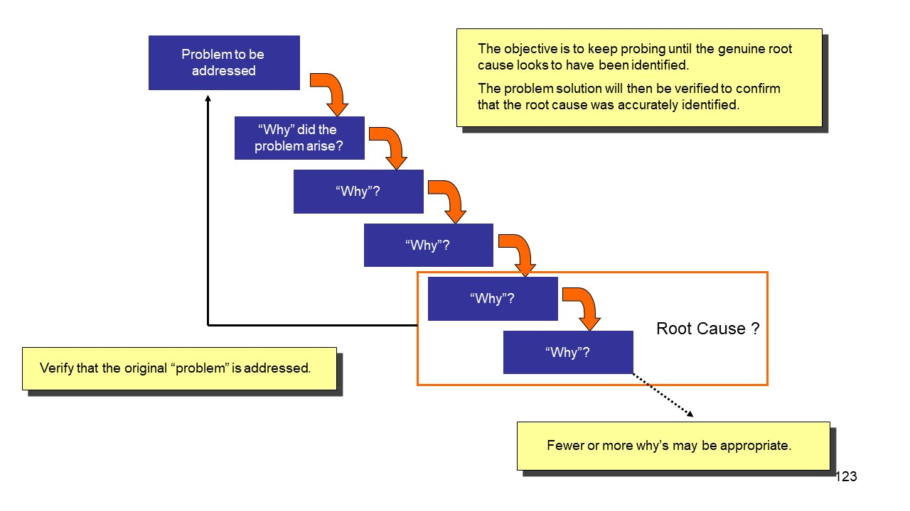

---
prev:
  text: 'Product Management Skills'
  link: '/notes/product-management/product-management-world/skill-needed-as-product-manager'

next:
  text: 'Problem Solution Fit'
  link: '/notes/product-management/problem-solution/problem-solution-fit/'

outline: 'deep'
---

# Define Users’ Problems

To define users' problems, we must start with our data, both primary and secondary. After collecting these data, we analyze what pain points users actually experience and what the root of their problems is. To find out what problems users actually experience, we can use the 5WHYs framework.

The 5 Whys technique is true to this tradition, and it is most effective when the answers come from people who have hands-on experience of the process or problem in question. The method is remarkably simple: when a problem occurs, you drill down to its root cause by asking "Why?" five times. Then, when a countermeasure becomes apparent, you follow it through to prevent the issue from recurring.

Here are the steps of using 5WHYs : 

1. **Step 1**  
Start with a broad question and try to answer it. 
Example	: Why was the app late? 
Answer	: It was late because there was a production delay.

2. **Step 2** 
Use your answer to ask a slightly more specific question. 
Example	: Why was there a production delay? 
Answer	: The delay happened because the engineering team had to release a last-minute patch, which the product team didn’t know about until launch day.

3. **Step 3** 
Keep narrowing the question and answering it. 
Example	: Why didn’t the product team know about the patch? 
Answer	: Because the engineering team didn’t tell them.

4. **Step 4** 
Continue to narrow down the question and answer. 
Example	: Why didn’t the engineering team communicate this to the product team? 
Answer	: Because they didn’t know how to share that information.

5. **Step 5** 
Ask one last question to find the root cause. 
Example	: Why didn’t the engineering team know how to communicate with the product team? 
Answer	: Because the product team had no clear point of contact or process for communication.

