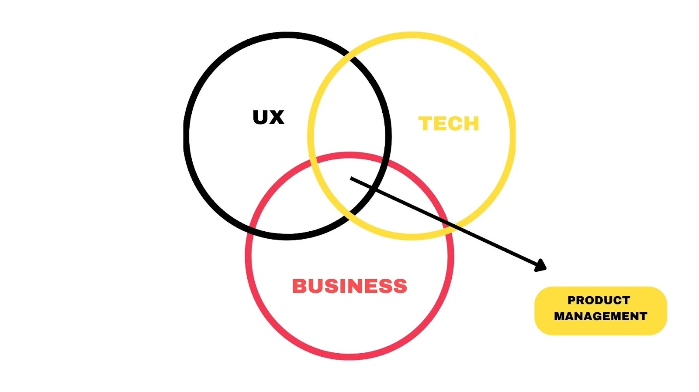

---
next:
  text: 'Product vs Project'
  link: '/notes/product-management/product-management-world/product-vs-project'

outline: 'deep'
---

# Introduction to Product Management

## What is Product Management?

Product Management is a role in a product development team that is responsible for managing the product development process, from doing research, defining problems to solve, initiating solutions, collaborating with the team & stakeholder, until the product is launched. They also do evaluation in the after-launched phase so the product can still sustain in the industry. In short, product management is the method of guiding a product from conception to market success. It demands a balance of strategic thinking, customer empathy, and cross-functional collaboration. 

Basically, Product Manager is the bridge between the business, User Experience (UX), and technology teams. A Product Manager should have expertise in one particular area and be willing to learn the other two, although it is not necessary to be an expert in all three.

Source: *https://revou.co/panduan-karir/apa-itu-product-manager*

- **Business** -->  A Product Manager needs to focus on optimizing the product to meet business goals, such as increasing profits, etc.
- **Technology** --> In choosing the product to be developed, the Product Manager needs to understand the development process and the proper utilization of technology for users.
- **UX** --> The Product Manager needs to ensure that the product has a good user experience. Although it is not essential to be a designer, the ability to test products, interact directly with users, and get feedback is very important for a PM to maximize the quality of the product developed so that it is comfortable to use by users.

::: info
Actually, Product Manager handle a lot of aspect in product development (not only those 3), but let’s focus on those aspect for start🙂
:::

## Difference between Product Management & Project Management

### Product Management
- Conduct by the **Product Manager**
- Manage product development from start until launch, event until after-launch phase
- **Long-term** development process
- How to keep the product **sustain**

### Project Management
- Conduct by the **Project Manager**
- Manage the project from start until done
- **Short-term** process
- How to run the project until **it's done/finish** (not sustain)