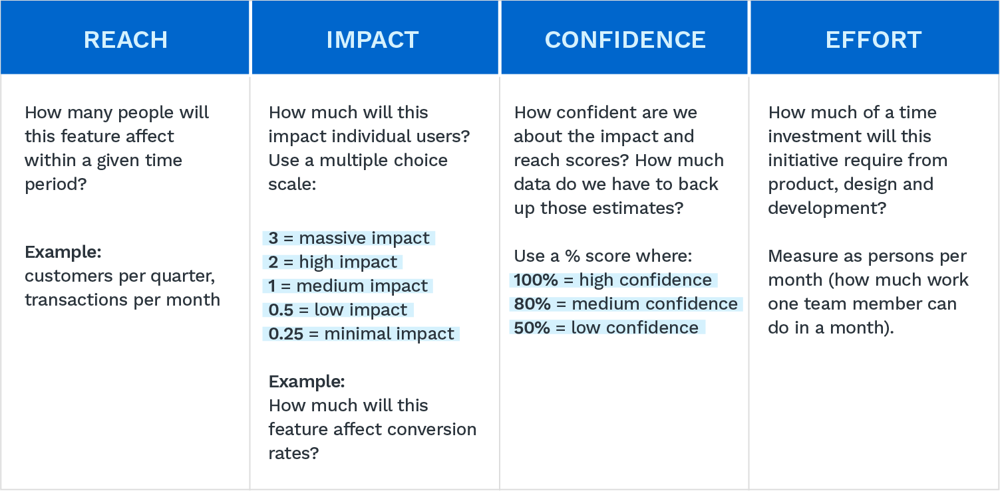
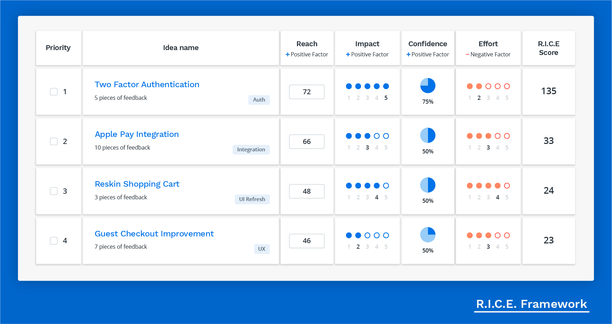
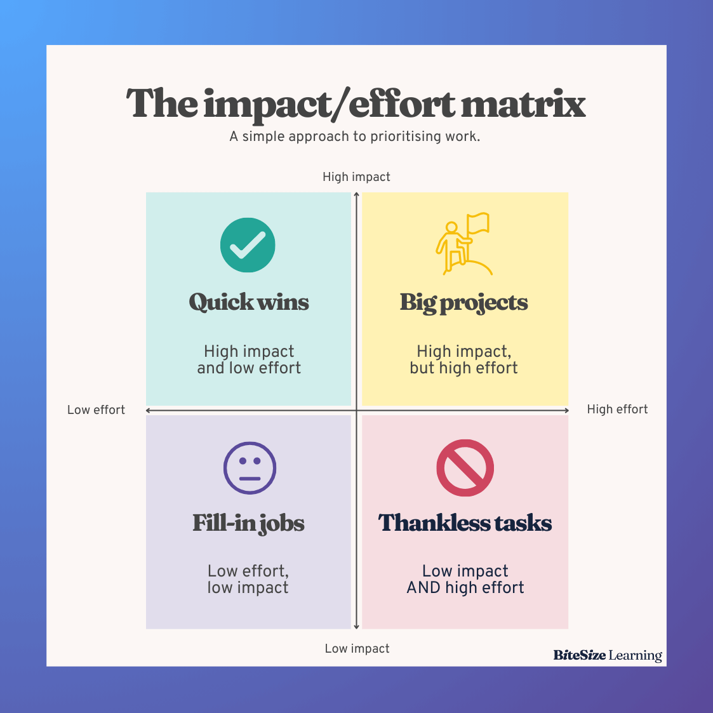
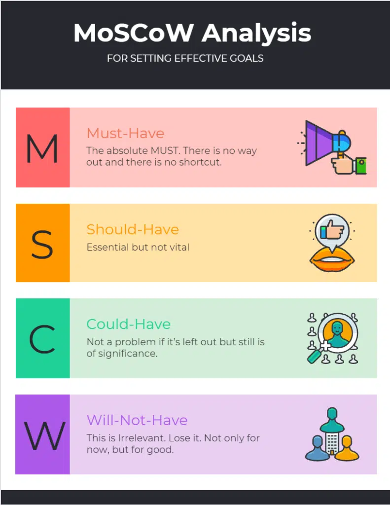
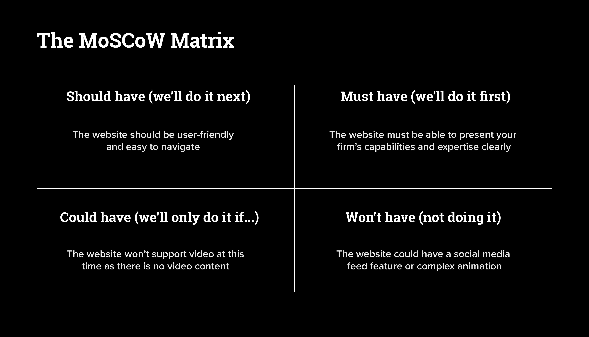

---
prev:
  text: 'Problem Solution Fit'
  link: '/notes/product-management/problem-solution/problem-solution-fit/'

next:
  text: 'Coming Soon'
  link: '/notes/product-management/problem-solution/prioritize-your-solution'

outline: 'deep'
---

# Prioritize your Solution

Ketika kita menemukan masalah yang yang dialami oleh pengguna, akan muncul banyak solusi yang mampu menjawab permasalahan tersebut. Namun, tidak semua solusi tersebut mampu diimplementasikan dalam sekali proses pengembangan. Lantas, bagaimana cara kita untuk menentukan fitur apa yang perlu diutamakan terlebih dahulu?

Kita dapat membuat prioritas solusi. Ada beberapa teknik prioritas yang dapat dilakukan.

## RICE method

Many people prefer the RICE scoring system because it considers confidence in a simple way, but it still leaves some uncertainty. MoSCoW is helpful for Product Managers as it highlights what is important to both customers and stakeholders, making it easier to manage expectations.

### Reach

RICE allows product teams to work on the initiatives that are most likely to impact any given goal. Measure this using the number of people who will benefit from a feature in a certain period of time, such as transactions per quarter or conversions per month. For example, “How many customers will use this feature per month?”

### Impact

Determine whether an idea achieves business goals or meets customer needs you’re trying to reach. It could be to delight customers (measured in positive reviews and referrals) or reduce churn.

### Confidence

A confidence percentage expresses how secure team members feel about their assessments of reach and impact. Measure the team’s confidence level in executing ideas with a percentage scale of high (100%), medium (80%), and low (50%).

### Effort

Considering effort helps balance cost and benefit. In an ideal world, everything would be high-impact/low-effort, although this is rarely the case. Calculate the time it will take the team (designers, engineers, etc.) to execute the idea.

These individual numbers are combined into one total score using a formula. This score gives product teams a consistent way to compare different projects or tasks when planning what to add to their roadmap. You can look at the example below.

## Impact-Effort Metrics

The Impact-Effort Matrix is similar to the RICE method but is better for people who prefer visual tools. This matrix shows how valuable (impact) a feature is for the user compared to how difficult (effort) it is to develop. To use this matrix, the Product Owner lists all features or ideas, and the team votes on where to place them on the impact and effort scale. Each feature ends up in one of four categories:

### Quick wins

Features that need little effort but have a big impact.

### Big bets

Features that need a lot of effort but can have a big impact. These can make a big difference if planned well but are risky if they don’t work, as they waste development time.

### Fill-ins

Features with low impact and low effort. They don’t take much time and are worth doing only when more important work is on hold. Good for when there are delays on bigger tasks.

### Money pit

Features that need a lot of effort but have little impact. They waste time and can hurt morale, so they should be avoided.

## MosCow

The MosCow Method is a four-step process for prioritizing product requirements around their return on investment (ROI). Apply this method company-wide to help frame discussions around what will increase revenue.
Here’s a breakdown of the model:

### Must Have (M)

These are the requirements needed for the project's success.

### Should Have (S)

These are important requirements for the project but not necessary.

### Could Have (C)

These requirements are “nice to have.” But don’t have as much impact as the others.

### Will Not Have (W)

These requirements aren’t a priority for the project.

If you are still confused, you can look at the example below for better understanding.

## Then, what framework should I use?

Many people like the RICE scoring system as it takes confidence into account in a qualitative way, but there are still a lot of uncertainties. RICE is most suitable for larger product teams with a more extensive user base in SaaS or consumer tech.

MoSCoW helps Product Managers by focusing on what is important to both customers and stakeholders, making it easier to handle their expectations. However, it’s easy to mark too many items as 'Must have,' which can use up too many resources. That’s why this framework is most suitable for early-stage product teams.

Impact-Effort metrics allows quick prioritization and works well when the number of features is small. It can be shared across the whole startup team, as it’s easy to understand at first glance. This matrix can be a good choice for Agile and Lean teams who want to move fast. Other teams can also use it as a preliminary method to sort features or product ideas.

There’s no right or wrong in choosing a framework for your product prioritization, as long as you understand how to use it and can get insight from the framework that you use.
