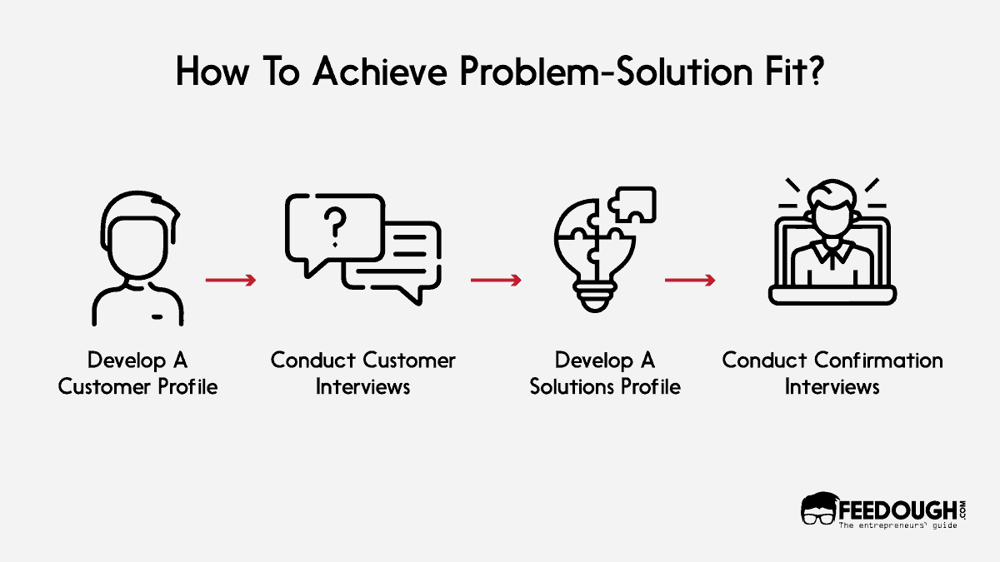
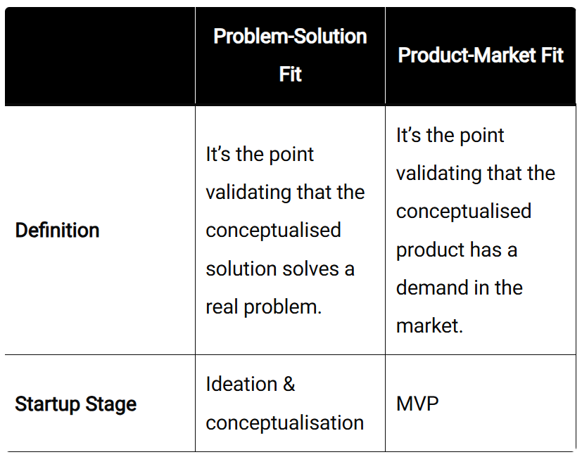

---
prev:
  text: 'Define Users Problem'
  link: '/notes/product-management/deep-dive-to-problem/define-users-problems'

next:
  text: 'Prioritize Your Solution'
  link: '/notes/product-management/problem-solution/prioritize-your-solution'

outline: 'deep'
---

# Problem Solution Fit

After knowing the user's problem, it's time to offer a solution that can solve their problem. For that, we need to prepare and ensure that our solution is problem-solution fit. Problem-Solution Fit means our product has a good solution for a specific customer problem. It’s not enough to just have a product idea—we need to make sure your product solves a real and important problem for our target customers, and that our team is capable of building it. This fit is important for reaching Product-Market Fit and needs a step-by-step, repeated approach to get right. Here's how Problem-Solution Fit fits into the bigger process:

- **Customer-Problem Fit:**  You find a major problem by understanding your customers well and confirming that the problem is real and worth solving.
- **Problem-Solution Fit:**  You check if your proposed solution is practical, doable, and able to solve the identified problem.
- **Customer-Solution Fit:**  You see if early users find your solution useful and appealing by testing it with a Minimum Viable Product (MVP).

The problem-solution fit precedes the product development and forms the foundation upon which a company is built. It helps you answer the basics startup-related questions before you even start your startup.

- Do people **actually have the problem** that you think they have?
- How do they **solve the problem now?**
- Does your proposed solution **make a meaningful difference?**

Here are the examples of Problem-Solution fit:

- Google solved the problem of finding useful information online by **making a search engine** that uses algorithms to rank websites based on how relevant they are to a user’s search.
- Facebook made it easier for people to **stay connected with others**, no matter where they are, by creating an **easy-to-use social platform** to keep in touch with friends and family.
- Spotify helped music artists get their songs heard legally by **creating a streaming** platform that makes it easy for people to find and listen to music. It also solved the problem for listeners who used to have to buy full albums just to hear one or two songs they liked

A solid Problem-Solution Fit means you can move ahead confidently, knowing that your solution is practical and wanted by your target customers.

**Then, what’s the difference between Product-Solution Fit and Problem-Market Fit?**

Similar but different. Product-Solution fit means solutions that are provided in our product solve users’ problems. Product-market fit means proving that people genuinely want and need your product or service to solve their problem.

## Unique Selling Point

Successful product teams know that nailing down a clear Unique Value Proposition (UVP) is the foundation of good product positioning. Your UVP is what makes your product stand out—why your product is better or different than the rest. To do this, teams zero in on the key benefits that really matter to their audience. Ask yourself: Why should someone choose this product over a competitor’s? It’s all about solving the right problem for the right customer.

