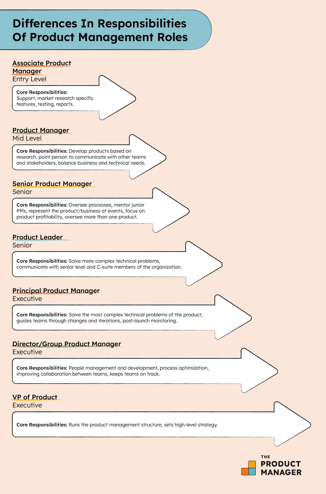

---
prev:
  text: 'Product vs Project'
  link: '/notes/product-management/product-management-world/product-vs-project'

next:
  text: 'Product Management Skills'
  link: '/notes/product-management/product-management-world/skill-needed-as-product-manager'

outline: 'deep'
---

# Product Manager Responsibilities

Have you ever wondered what PMs actually do in the product development process? 
Here I will spill the tea for you

- Identify user’s problems and conduct in-depth root cause analysis.
- Prioritize the key requirements for specific product features.
- Collaborate with design teams to enhance the overall customer/user experience.
- Collaborate with developer/technical teams to ensure seamless product development.
- Guide teams throughout the product development process.
- Oversee and maintain the product roadmap and manage product launch.
- Clearly understand and articulate the product’s value propositions.
- Generate new product concepts based on thorough research and data analysis.
- Collaborate with PR and marketing teams to effectively manage product launches.

If we talk about the Product Manager career path, of course each level has different responsibilities.

