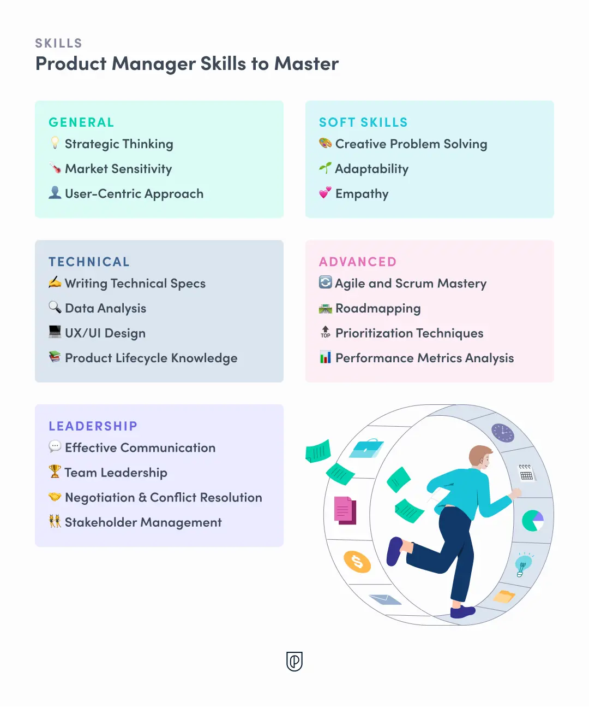
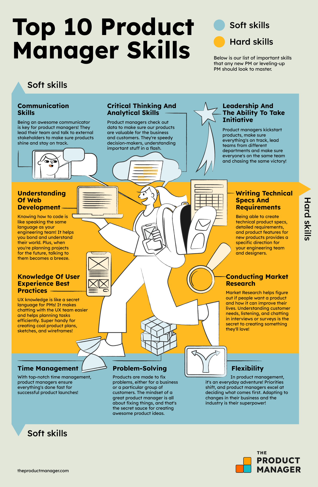

---
prev:
  text: 'Product Management Resposibilities'
  link: '/notes/product-management/product-management-world/product-manager-responsibilities'

next:
  text: 'Understand Users Problem'
  link: '/notes/product-management/deep-dive-to-problem/understand-users-problem'

outline: 'deep'
---

# Skill Needed as Product Manager

## PM’s Hardskill

### Basic product management knowledge (theory)
As a product manager, we must know basic knowledge about product management, such as what product management is, its responsibilities, and scope of work of Product Management itself.

### Research & analysis
To create successful products, product managers need to deeply understand their market. This means doing research on market trends, competitors, and target users. This helps them find growth opportunities and spot possible risks to the product's success. To do well in this role, staying curious and constantly researching is important to stay ahead.

### Research & analysis
How do product managers make sure everyone is working on the right tasks at the right time and meeting goals and deadlines? By using strong prioritization.

As a product manager, you’ll quickly see that ideas and requests come from all directions. You can’t do everything, so you need to decide what is most important and what can wait. Sometimes, this means making tough choices that may upset others. So, you need to not only prioritize well but also be ready to explain why you made those choices.

### Basic user experience knowledge
A product manager’s job is to launch products that benefit the business and meet user needs. They represent the user’s interests at every stage of the product cycle and work closely with UX designers and researchers.

As a product manager, you don’t need to be a UX design expert, but you should know user experience basics, best practices, and processes. This helps you explain product needs clearly, understand how complex and time-consuming design tasks can be, and work better with the design team. Plus, knowing UX well lets you keep a user-focused approach in your work.

### Basic business & economics knowledge
Product managers have a strategic role in creating a product vision that matches business goals, which requires strong business knowledge. It's important to understand how different parts of the business work together for success, including budgeting, cash flow, and profit margins. They also need to know company metrics and KPIs (key performance indicators). Having good business sense helps them see the big picture and connect daily actions to the overall strategy. Try to learn what drives the company's success, how it measures that success, and how each department contributes.

### Software Development Life Cycle (SDLC)
Product managers need to understand the Software Development Life Cycle concept. Understanding Agile methods and Scrum practices is necessary to handle the step-by-step development process well. Knowing these frameworks helps them adapt to changes, keep delivering value, and stay in line with customer needs and company goals. Mastering Agile and Scrum is more than just following steps—it’s about creating an agile mindset in the team, encouraging teamwork, openness, and a strong focus on quality.

### Product Lifecycle knowledge
Knowing the product life cycle is important for a product manager because it helps them guide the product from start to finish effectively. Understanding each stage—such as idea generation, development, launch, and post-launch improvements—allows them to plan, anticipate challenges, and make decisions that align with the product’s strategy and market needs. It helps them manage timelines, allocate resources, and ensure smooth transitions between stages.

## PM’s Softskill

### Empathy
Empathy means understanding and sharing someone else’s feelings, and it’s key to user-focused product design. For product managers, empathy goes beyond users to include team members and stakeholders. It’s about truly understanding their views, challenges, and goals. This helps product managers make better decisions, create a positive team culture, and build trust with stakeholders. By seeing things from others’ points of view, product managers can make products that meet user needs and build strong connections, boosting engagement and loyalty. You can improve empathy by practicing seeing other perspectives, volunteering to learn different experiences, and regularly getting user feedback.

### Leadership and Interpersonal skills
Leadership and interpersonal skills are crucial for navigating the complexities of team dynamics, stakeholder expectations, and the collaborative nature of product development. This skill includes effective communication, team leadership, stakeholder management, negotiation & conflict resolution.

### Critical Thinking
Product managers need strong critical thinking skills to interpret data, weigh different options, make strategic decisions, and solve problems effectively. They must be capable of spotting potential risks and opportunities, crafting innovative solutions to complicated issues, and using critical analysis to shape the most effective product strategies.

### Data-driven thinking
Data is like the fuel that powers a customer-focused approach in any company. Being skilled with data helps you stay open to learning and understand what works and what doesn’t. For product managers, data answers key questions like:
- Who are your customers?
- Why do they use your product?
- What do they think about it?

Using data helps product managers balance urgent and non-urgent tasks, improve their strategic thinking, and make better decisions confidently.

### Strategic thinking
Everything a product manager does should align with the overall strategy. Strategic thinking guides your decisions, helps you set priorities, shapes your product vision, and sets goals to achieve that vision.

### Problem-Solving Creativity
Product management is all about solving problems, whether they're user issues, technical hurdles, or team challenges. Great product managers shine because they solve problems creatively, using both innovative and analytical thinking. They combine different ideas, look at solutions carefully, and apply them in new ways to overcome obstacles, turning problems into chances for growth. To boost creative problem-solving, you start from basic principles, brainstorm with different people, and learn from various sources.

### Time Management
Product managers often work on many products and projects at the same time and need to adapt to changing priorities. Good time management helps product managers handle all their tasks while finishing work on time and moving products toward launch. Time management can always be improved as you figure out what works best for you.
