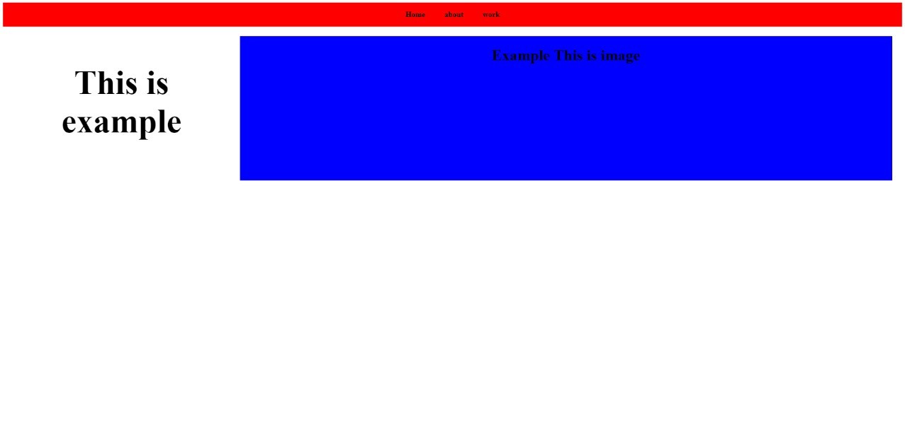
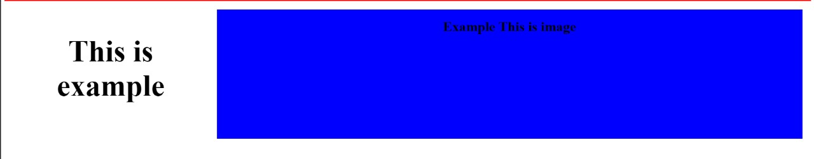

# CSS LAYOUT MODEL
> learn to create a neat website appearance using flex, grid, justify, and a lot another properties 

CSS layout method used to flexibly arrange and organize elements in a container. With Flexbox, we can easily adjust the position, size, and spacing of elements to make them look neat, both horizontally and vertically.

for example here we want to create a layout like the image below:


to create a layout like the image below there are 2 ways that can be implemented so that the layout we create is appropriate, namely by using flex and grid

## 1. Flex 
Flex is one-dimensional (1D) layout method, which means elements are only arranged in rows (horizontal) or columns (vertical), but not both at once.  therefore flex is usually used to arrange elements in one direction (horizontal or vertical). Suitable for simple layouts such as navbar, buttons, or rows of interrelated elements.

so here using flex so that the navbar that I made is neat and in accordance with the design. Here is an example of the code in html and css:
```html
<div id="navbar">
    <p> Home </p>
    <p> about </p>
    <p> work </p>
</div>
```

```css
#navbar{ 
    background-color: red;
    display: flex;
    justify-content: center;
    gap: 40px;
    font-weight: bolder ;
}
```


## 2.Grid
Grid is a two-dimensional (2D) layout method, which allows you to arrange elements in rows and columns simultaneously. for grid is different from flex is usually used to create complex layouts involving structures such as full pages with headers, sidebars, main content, and footers.


so here using Grid so that the main content that I made is neat and in accordance with the design. Here is an example of the code:
```html
<div class="example-container">
    <h1 class="ha1">This is example</h1>

    <div class="img">
        <h1>Example This is image</h1>
    </div>
</div>
```

```css
.example-container {
    display: grid;
    grid-template-columns: 1fr 3fr; 
    gap: 20px; 
    padding: 20px; 
}

.ha1 {
    text-align: center;
    padding: 10px;
    font-size: 70px;
}

.img {
    background-color: blue;
    justify-items: center;
    width: 100%;
    height: 300px;
}
```



