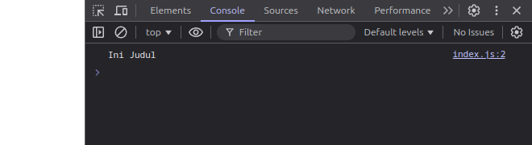
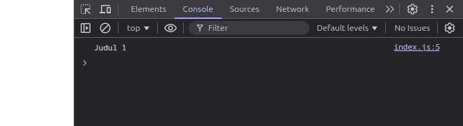
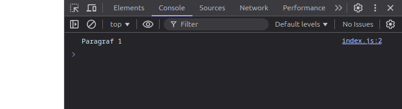
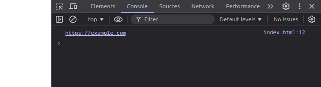
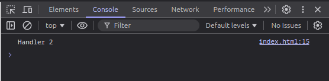

# Java Script DOM (Document Object Model) 
> Learn about what DOM is, what its function is, why you should learn DOM before using the framework, and DOM implementation

Dom or Document Object Model is a programming interface that allows us as users to manipulate HTML or XML documents dynamically using JavaScript. With DOM, elements in a web page can be accessed, changed, added, or removed. It is very important to learn DOM first before entering a framework like react because DOM is the basic foundation of how a web page works. React and other frameworks use concepts that are directly related to DOM, so understanding this helps you understand how the framework works more easily.

DOM consists of nodes such as:

`Element Node`: Representation of HTML elements `<div>`,  `<p>`

`Text Node`: Representation of text within an element.

`Attribute Node`: Representation of element attributes `id`, `class`

::: details Overview of the Materials 📚

- **How to Access DOM Elements:** learn methods like getElementById, querySelector, and others to locate and access specific elements in the DOM.
- **Manipulating Content:** Discover how to modify HTML content, attributes, and styles dynamically using JavaScript.

:::

## 1. How to Access DOM Elements
The DOM allows us to access elements on the page using various methods:

### 1.1 document.getElementById()
document.getElementById() Used to access elements based on the id attribute. where Only returns one element because id in HTML should be unique. so its use is Fast and efficient.

examples how to use:
``` html
<h1 id="judul">Ini Judul</h1>
```

```js
const elemen = document.getElementById("judul");
console.log(elemen.textContent);
```

Output: 


---

### 1.2 document.querySelector()
document.querySelector() Used to access the first element that matches a CSS selector (id, class, tag, or other selector combinations). This method can be said to be very flexible because it can use complex selectors.

examples how to use:
```html
<div class="kotak">
    <h1 class="judul">Judul 1</h1>
    <h1 class="judul">Judul 2</h1>
</div>
```

```js
const elemen = document.querySelector(".judul");
console.log(elemen.textContent);
```
Output: 
The output produced is Judul 1 because judul 1 is the first element of the "judul" class.


---

### 1.3 document.getElementsByClassName()
document.getElementsByClassName() is almost the same as document.getElementById(), the difference is that it is used to access elements based on class name and can return an HTMLCollection (similar to an array, but not an actual array) containing all elements with the same class.

examples how to use:
```html 
<p class="teks">Paragraf 1</p>
<p class="teks">Paragraf 2</p>
<p class="teks">Paragraf 3</p>
```

```js
const elemen = document.getElementsByClassName("teks");
console.log(elemen[0].textContent); 
```

Output: 



## 2. Manipulating Content
in manipulating our content as users using DOM properties to change text or HTML elements, not only that we can also change CSS styling

Important Properties:

`textContent`: Gets or changes text inside an element without processing the HTML and Does not render any HTML tags in the text.

Example of TextContent where i want to change hello world to welcome:
```html
<h1 id="judul">Hello World</h1>
<script>
    const judul = document.getElementById("judul");
    judul.textContent = "Welcome!"; 
</script>
```

---

`innerHTML`: Take or change the HTML content in an element, the advantage is that it can be used to add HTML tags in an element.

Example of innerHTML:

in this Example i want to add a `<p>` tag with paragraph content to the existing html file
```html
<div id="kontainer"></div>
<script>
    const kontainer = document.getElementById("kontainer");
    kontainer.innerHTML = "<p>Paragraf Baru</p>"; 
</script>
```

---

`innerText`: Same as textContent, but respects CSS styles

Example of innerText:

In this example, the output will be empty because the CSS style is display: none.
```html
<p id="teks" style="display: none;">Teks ini disembunyikan</p>
<script>
    const teks = document.getElementById("teks");
    console.log(teks.innerText); 
</script>
```

---
### 2.1 Manipulating Attributes
in this section we will learn that Attributes can be used to add additional information to HTML elements, such as id, class, src.

some methods used to change, retrieve values ​​and delete an attribute are:

1. `setAttribute()` which is Used to add or change element attributes.

Example of changing src attribute in html:
```html

<script>
    const gambar = document.getElementById("gambar");
    gambar.setAttribute("src", "baru.jpg"); 
</script>
```

Output: 


---

2. `getAttribute()` is used to Get attribute value from element

Example output `https://example.com` instead of `Click Here`:
```html
<a id="link" href="https://example.com">Click Here</a>
<script>
    const link = document.getElementById("link");
    console.log(link.getAttribute("href"));
</script>
```

Output: 


---

3. `removeAttribute()` is used to Removes an attribute from an element.

Example of removing the disable attribute, so that buttons that should not be able to be pressed because they are disabled can be pressed:
```html
<button id="tombol" disabled>Submit</button>
<script>
    const tombol = document.getElementById("tombol");
    tombol.removeAttribute("disabled"); // Remove the 'disabled' attribute
</script>
```

---

### 2.2 Manipulating CSS 
Manipulating CSS here allows us to change the styling of elements using JavaScript. In CSS manipulation there are 2 methods, namely we can change CSS properties directly, the other method is we can add and delete existing classes.

1. The first is style properties which allow us to change CSS properties directly.

Example here changes the color and size of the text:
```html
<p id="teks">Ini teks biasa.</p>
<script>
    const teks = document.getElementById("teks");
    teks.style.color = "blue"; 
    teks.style.fontSize = "20px"; 
</script>
```

---

2. the second is adding and removing classes using classList.add() to add classes. and classList.remove(): Remove classes.

For example, here I delete the color class contained in the HTML tag:
```html 
<div id="kotak" class="warna"></div>
<style>
    .warna { background-color: yellow; }
</style>
<script>
    const kotak = document.getElementById("kotak");
    kotak.classList.remove("warna"); 
</script>
```
---

### 2.3 Event Handling 
event handling is used to handle user interactions, such as clicks, input, or hover. 
To handle user interactions, there are methods that can be used.

1. `addEventListener()`

For example, I want to create a button that, when clicked by the user, will display an alert popup with the message "Button clicked!".
```html
<button id="tombol">Klik Saya</button>
<script>
    const tombol = document.getElementById("tombol");
    tombol.addEventListener("click", function() {
        alert("Tombol diklik!");
    });
</script>
```

---

2. `onclick()`
Using `onclick` is not much different from using `addEventListener()` but there is a drawback in using `onclick` which is that it can only store one event handler. If you set a new event handler, the old one will be overwritten.

Contoh menggunakan Onclik:
```html
<button id="tombol">Klik Saya</button>
<script>
    const tombol = document.getElementById("tombol");
    tombol.onclick = function() {
        alert("Tombol diklik dengan onclick!");
    };
</script>
```

Examples Disadvantages of onclick: 
```js
tombol.onclick = function() {
    console.log("Handler 1");
};
tombol.onclick = function() {
    console.log("Handler 2");
};
```
Output: 

---

3. Special events for input, such as `change`, `input`, or `submit`.`
Special event for input used to handle user interaction with input elements such as text, checkboxes, or forms. With this event, you can dynamically process data entered by the user or validate input before the data is submitted.

This example displays the text entered by the user by using `input` to store the text:
```html
<input id="input" type="text" placeholder="Ketik sesuatu">
<script>
    const input = document.getElementById("input");
    input.addEventListener("input", function(event) {
        console.log(event.target.value);
    });
</script>
```

Example of using `change` which is used to change the email that has been entered by the user: 
```html
<input type="text" id="email" placeholder="Masukkan email Anda">

<script>
    const inputEmail = document.getElementById("email");

    inputEmail.addEventListener("change", function() {
        alert("Email Anda: " + inputEmail.value); 
    });
</script>
```

---

### 2.4 Adding or Removing Elements
In this section, you will learn how to dynamically add or remove HTML elements through DOM manipulation. This is useful for updating web page content without the need to reload.

#### 2.4.1 Adding
1. First one is add element using `document.createElement()` which is used to create new elements dynamically.
The created elements can be inserted into the document using methods such as `appendChild()` or `insertBefore()`.

Example: 

here I want to create an html tag `<p>`, then add text into the tag. after that insert the `<p>` tag containing the paragraph into the `<div>` tag:
```html
<div id="kontainer"></div>
<button id="tambah">Tambah Paragraf</button>

<script>
    const kontainer = document.getElementById("kontainer");
    const tombolTambah = document.getElementById("tambah");

    tombolTambah.addEventListener("click", function() {
        const paragraf = document.createElement("p"); // Creating a <p> element
        paragraf.textContent = "Ini paragraf baru."; // Add text to <p>
        kontainer.appendChild(paragraf); // Adding a paragraph to a <div>
    });
</script>
```

---

2. The second is Using innerHTML to
Add elements by directly inserting HTML. This is a fast way, but is not recommended for dynamic elements because it can overwrite old content.

Example: 

```html
<div id="kontainer"></div>
<button id="tambah">Tambah Elemen</button>

<script>
    const kontainer = document.getElementById("kontainer");
    const tombolTambah = document.getElementById("tambah");

    tombolTambah.addEventListener("click", function() {
        kontainer.innerHTML += "<p>Ini elemen baru.</p>"; // Adding elements with innerHTML
    });
</script>
```

---

3. the last way to add is to use insertAdjacentHTML by inserting HTML without overwriting existing elements. This is a flexible way with position options such as `beforebegin`, `afterbegin`, `beforeend`, and `afterend`.

Example:
```html
<div id="kontainer">
    <p>Paragraf pertama.</p>
</div>
<button id="tambah">Tambah Paragraf</button>

<script>
    const kontainer = document.getElementById("kontainer");
    const tombolTambah = document.getElementById("tambah");

    tombolTambah.addEventListener("click", function() {
        kontainer.insertAdjacentHTML("beforeend", "<p>Paragraf kedua.</p>"); // Add after the last content of <div>
    });
</script>
```

---

#### 2.4.2 Remove

1. Using `removeChild()` to Remove a child element from a parent element.
```html 
<div id="kontainer">
    <p id="paragraf">Ini paragraf yang akan dihapus.</p>
</div>
<button id="hapus">Hapus Paragraf</button>

<script>
    const kontainer = document.getElementById("kontainer");
    const tombolHapus = document.getElementById("hapus");

    tombolHapus.addEventListener("click", function() {
        const paragraf = document.getElementById("paragraf");
        kontainer.removeChild(paragraf); // Remove paragraph from <div>
    });
</script>
```
---

2. Using `remove()` This method you can use to directly remove elements from the DOM without needing the parent element.
```html
<p id="paragraf">Ini paragraf yang akan dihapus.</p>
<button id="hapus">Hapus Paragraf</button>

<script>
    const tombolHapus = document.getElementById("hapus");

    tombolHapus.addEventListener("click", function() {
        const paragraf = document.getElementById("paragraf");
        paragraf.remove(); // Instantly delete an element
    });
</script>
```

---

3. Delete All Child Elements which is definitely used to delete all child elements from a parent element.
```html
<div id="kontainer">
    <p>Paragraf pertama.</p>
    <p>Paragraf kedua.</p>
</div>
<button id="hapusSemua">Hapus Semua</button>

<script>
    const kontainer = document.getElementById("kontainer");
    const tombolHapusSemua = document.getElementById("hapusSemua");

    tombolHapusSemua.addEventListener("click", function() {
        kontainer.innerHTML = ""; // Removes all elements inside a <div>
    });
</script>
```